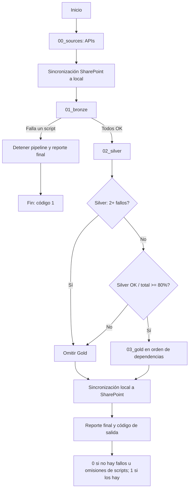

# Estructura código fuente

La solución está organizada por responsabilidades: ingesta, capas de procesamiento, publicación, configuración, pruebas y observabilidad. La siguiente tabla muestra las carpetas principales y su función dentro del proyecto, sin detallar la organización interna de cada fuente.

| Carpeta | Descripción |
| --- | --- |
| `00_sources/` | Componentes de entrada al sistema. Contiene muestras y scripts para consultar fuentes API y sincronizar archivos con SharePoint. |
| `01_bronze/` | Capa de aterrizaje de datos. `data/` conserva los archivos recibidos y `parquet/` almacena los snapshots generados para el procesamiento reproducible; `scripts/` contiene la ingesta y validación inicial. |
| `02_silver/` | Capa de limpieza y estandarización. `data/` contiene los resultados transformados; `scripts/` ejecuta los procesos de limpieza y `utils/` reúne utilidades propias de esta capa. |
| `03_gold/` | Capa analítica final. `data/` contiene las dimensiones y hechos consolidados, mientras `scripts/` ejecuta los procesos Gold respetando sus dependencias. |
| `04_reporting/` | Artefactos de consumo y presentación, incluido el modelo de Power BI y materiales de referencia del tablero. |
| `05_tests/` | Pruebas automatizadas y archivos auxiliares para verificar ingestas, transformaciones, sincronización y resultados Gold. |
| `06_docs/` | Documentación técnica y registro de decisiones del proyecto. La documentación MkDocs se encuentra dentro de `Documentacion/`. |
| `07_config/` | Configuración central de fuentes, mapeos, logging y reportes de validación. |
| `08_notebooks/` | Notebooks y recursos de exploración o validación puntual de datos, incluyendo pruebas relacionadas con Parquet. |
| `09_logs/` | Evidencias de ejecución organizadas por origen, capa, ingesta y pipeline; incluye el log maestro y los logs individuales de los procesos. |
| `utils/` | Librerías transversales reutilizadas por las capas, como logging y transformaciones comunes. |

En la raíz también se encuentran `pipeline.py`, que coordina la ejecución de extremo a extremo, `requirements.txt`, que declara las dependencias, y `README.md`, que presenta la solución.

# Esquema de ejecución

Esta página presenta el mapa conceptual del flujo de datos del Modelo Analítico de Seguimiento MEGAS, desde sus orígenes hasta el tablero de Power BI. Su objetivo es ubicar cada componente y sus reglas de paso; el detalle de implementación de cada capa se encuentra en [Capa Bronce](02.Capa_bronce.md), [Capa Plata](03.Capa_plata.md), [Capa Oro](04.Capa_oro.md) y [Pipeline](05.Pipeline.md).

## Flujo de punta a punta

## Orígenes

El proceso recibe archivos manuales publicados en SharePoint, principalmente Excel y CSV, organizados en aproximadamente nueve grupos de fuentes. También incorpora fuentes API para Vigigas, TRM y MB TX Propane/Butane. La configuración de las fuentes y su estado de procesamiento se mantiene en `07_config/sources.yaml`.

Al inicio de la ejecución, `sync_sharepoint.py` compara el contenido remoto con el directorio local y descarga de forma incremental los archivos Bronze nuevos o modificados. La comparación utiliza el tamaño y la fecha de modificación. En paralelo, los scripts de las API escriben sus resultados directamente en `01_bronze/data/`.

## Arquitectura de Almacenamiento y Trazabilidad de Datos

El formato de salida establecido para todas las capas del pipeline es *Parquet*. Este estándar de almacenamiento columnar y altamente comprimido optimiza el espacio en disco y garantiza la integridad de la información gracias a sus metadatos incrustados.

Esta decisión tecnológica y arquitectónica proporciona las siguientes ventajas operativas:

- **Gobierno, Auditoría y CDC**: El registro histórico e inmutable en la capa Bronze permite realizar auditorías exactas sobre el estado de la información en cualquier momento del pasado. Además, facilita la implementación de modelos de Captura de Datos Cambiantes (CDC) para actualizar las capas Silver/Gold y sienta las bases para funcionalidades avanzadas como el "viaje en el tiempo" (time travel).

- **Rendimiento analítico superior**: A diferencia de los formatos basados en filas, la estructura columnar de Parquet permite realizar lecturas selectivas (projection pruning). Esto significa que las consultas solo procesan las columnas necesarias, reduciendo drásticamente el consumo de memoria, CPU y tiempos de ejecución.

- **Filtrado eficiente (Pushdown Predicates)**: Los metadatos internos de Parquet almacenan estadísticas clave (como los valores mínimos y máximos) de cada bloque de datos. Esto permite que los motores de procesamiento descarten archivos completos sin tener que leerlos si no cumplen con los filtros de la consulta.

!!! note
    El diseño del procesamiento de datos asegura la inmutabilidad de los datos: **no se permite la alteración o edición directa de los registros durante su paso por las distintas capas**. Para lograr esto y mantener una trazabilidad completa, la capa Bronze captura la información cruda operando bajo un modelo de inserción continua (append-only). Cada variación o cambio proveniente de la fuente original queda registrado como un nuevo evento, acompañado de su respectiva marca temporal (timestamp).

## Bronze

Bronze conserva la entrada recibida y genera una representación reproducible para el procesamiento posterior. `get_data.py` interpreta los archivos según la configuración de cada fuente y genera snapshots Parquet con marca de tiempo en `01_bronze/parquet/<source_id>/`, con el formato `<archivo>__<timestamp>.parquet`. La ejecución también registra el resultado de la ingesta en `audit_log.csv`.

Después de la ingesta, `validate_schema.py` comprueba que la estructura recibida sea compatible con `07_config/mappings.yaml`. Bronze es el umbral de integridad del pipeline: si falla cualquiera de sus pasos críticos, no se ejecutan Silver ni Gold.

!!! note
	Un fallo individual de una fuente API se registra y permite continuar con las fuentes manuales. Esta tolerancia no aplica a Bronze: un fallo de Bronze detiene el procesamiento de las capas siguientes.

## Silver

Silver transforma los datos de Bronze en conjuntos preparados para el modelado. La capa contiene un proceso de limpieza por fuente, apoyado por `transformers_silver.py` como librería común. A nivel conceptual, aquí se realizan la limpieza, el tipado, la deduplicación (validación de registros duplicados) y la conformación de claves primarias.

Los fallos de fuentes Silver se aíslan para permitir que continúen las demás. Sin embargo, la ejecución de Gold requiere que Silver complete al menos el 80% de sus procesos y que no se hayan acumulado dos o más fallos.

!!! tip
	El 80% es el mínimo operativo para habilitar Gold. Alcanzar ese umbral no elimina las validaciones de dependencias: cada proceso Gold solo se ejecuta cuando sus entradas requeridas están disponibles.

## Gold

Gold consolida los datos para consumo analítico mediante procesos `dim_*` y `fact_*`. Los procesos se ejecutan en un orden topológico definido por sus dependencias internas, con `transformers_gold.py` como librería común. Si un proceso falla, los procesos que dependen de él se omiten para evitar resultados incompletos o inconsistentes.

El resultado se publica en `03_gold/data/` y constituye la interfaz de datos del tablero. Gold no debe interpretarse como una copia de Silver: es la capa donde se integran las entidades y hechos finales que requiere el modelo de BI.

## Reporting

`04_reporting/Modelo Analítico Seguimiento Megas.pbix` consume únicamente los datos de Gold. Esta separación evita que el tablero dependa directamente de archivos crudos, snapshots Bronze o transformaciones intermedias, y permite que los cambios de ingesta y limpieza permanezcan dentro del pipeline.

!!! note
	Para Power BI Desktop la actualización del .pibx se debe hacer manual en el botón actualizar en la barra de herramientas.

## Orquestación y logs

`pipeline.py` ejecuta las etapas en orden, conserva el estado de cada script y decide si la siguiente capa puede comenzar. El orden general es: 

- Fuentes API
- Sincronización de archivos Bronze
- Bronze
- Silver
- Gold
 
 Las API pueden fallar sin detener la ejecución; Bronze detiene todo al fallar; Silver continúa ante un fallo individual, pero bloquea Gold con dos o más fallos o cuando no alcanza el 80%; Gold respeta sus dependencias y omite los procesos bloqueados.

El logging se centraliza mediante `utils/logger.py` y `07_config/logging_config.yaml`. `09_logs/` conserva el log maestro del pipeline y logs separados por script y capa, incluido el log específico de la sincronización SharePoint. Al finalizar, la sincronización bidireccional sube a SharePoint el código y la configuración respaldables, los archivos Bronze, los Parquet de las capas y los logs; las credenciales y llaves privadas se excluyen.

