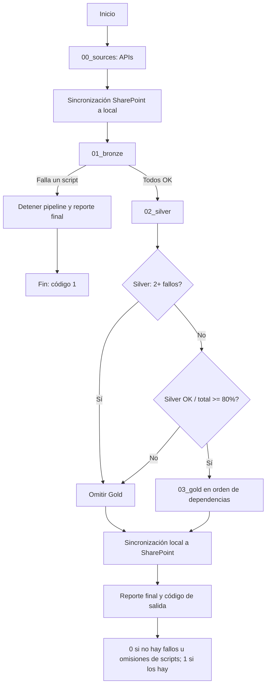

# Pipeline: orquestador principal

`pipeline.py` coordina la ejecución de las capas `00_sources`, `01_bronze`,
`02_silver` y `03_gold`. Las listas de scripts y las dependencias de Gold se
declaran en el propio orquestador. El pipeline se ejecuta desde la raíz del
proyecto:

```bash
python pipeline.py
python pipeline.py --env prod
PIPELINE_ENV=prod python pipeline.py
```

El entorno predeterminado de SharePoint es `test`. El argumento `--env` tiene
prioridad sobre `PIPELINE_ENV`.

## 1. Orden de ejecución

La ejecución sigue este orden:



### 0. Fuentes API

`SOURCES_API_SCRIPTS` ejecuta, con un tiempo máximo de 30 segundos por proceso:

- `00_sources/scripts/01_vigigas/vigigas_api_client.py`
- `00_sources/scripts/03_mb_tx_propane/mb_tx_propane_api.py`
- `00_sources/scripts/04_trm/trm_api.py`

Si una API falla, el orquestador registra el fallo y continúa con las demás y
con las fuentes manuales de Bronze. Estas entradas no incluyen `api_satrack.py`
ni `api_zencillo.py`, que están excluidos del orquestador.

### 0.1. Sincronización SharePoint a local

Se crea `SharePointSync` y se ejecutan `sync_folder_structure()` y
`download_bronze_incremental()`. La primera asegura las carpetas locales que
no existen en SharePoint; la segunda descarga en `01_bronze/data` los archivos
Bronze nuevos o modificados. Si esta fase falla, el error se registra y el
pipeline continúa con los archivos locales que ya existan.

Un fallo al crear alguna carpeta se registra dentro del resumen de la
sincronización, pero no detiene la ejecución. El detalle técnico queda en
`09_logs/ingestion/sharepoint.log`.

### 1. Bronze

`BRONZE_SCRIPTS` ejecuta, en este orden:

1. `01_bronze/scripts/01_costo_ventas_bronce.py`
2. `01_bronze/scripts/get_data.py`
3. `01_bronze/scripts/validate_schema.py`

Bronze usa `stop_on_failure=True`. Cuando un script falla, los siguientes se
registran como omitidos (`↷`), no se ejecutan Silver ni Gold y el proceso sale
con código `1`.

### 2. Silver

`SILVER_SCRIPTS` contiene los procesos de limpieza de las fuentes. La capa no
se detiene ante el fallo de un script: registra `✗` y continúa con los demás.

Gold solo queda habilitado cuando se cumplen simultáneamente estas reglas:

- Silver tiene menos de dos scripts fallidos.
- La razón `scripts OK / scripts totales` es igual o superior a `80%`.

Por tanto, Gold se bloquea con dos o más fallos aunque el porcentaje sea igual
o superior al 80%. También se bloquea cuando el porcentaje es menor al 80%.
En esos casos todos los scripts Gold se registran como omitidos.

En `07_config/sources.yaml`, `status: on` identifica una fuente activa y
`status: off` una fuente desactivada; `final_layer` indica hasta qué capa está
configurada (`bronze`, `silver` o `gold`). Esos valores son metadatos de las
fuentes que usan los procesos de las capas. Las listas que el orquestador
ejecuta son las declaradas en `pipeline.py`, no una lista reconstruida en
tiempo de ejecución a partir del YAML.

### 3. Gold

Gold ejecuta `GOLD_SCRIPTS` según el orden producido por
`resolve_gold_order(GOLD_SCRIPTS_RAW, GOLD_DEPENDENCIES)`. La función aplica un
orden topológico y conserva, en lo posible, el orden original para scripts sin
dependencias declaradas. Un ciclo de dependencias provoca un error explícito.

Si una dependencia falló o fue omitida, el script dependiente no se ejecuta:
se registra con `↷` y la razón `Dependencia(s) no disponible(s)`. Un fallo de
Gold no detiene la ejecución de los scripts Gold posteriores que no estén
bloqueados por ese fallo.

Las dependencias declaradas incluyen, entre otras, `dim_clientes.py` respecto
a `fact_ventas.py` y `fact_cartera.py`, y `fact_estados_resultados.py` respecto
a `fact_ventas.py`. La fuente autoritativa y completa es
`GOLD_DEPENDENCIES` en `pipeline.py`.

### 4. Sincronización local a SharePoint

Después del reporte de las capas, si la instancia SharePoint se creó con
éxito, se ejecutan:

- `upload_backup_and_config()`: sube código de `00_sources`, los scripts de
	las tres capas, `utils`, `pipeline.py`, `07_config/sources.yaml` y
	`07_config/mappings.yaml`.
- `upload_parquets_and_logs()`: sube `01_bronze/data`, los Parquet de
	`01_bronze/parquet`, `02_silver/data`, `03_gold/data` y los archivos `.log`
	de `09_logs`.

No se suben `.env`, `credenciales.env`, `credentials.json`, `key.pem`, archivos
con extensión `.pem` o `.key`, ni `__pycache__` o archivos `.pyc`/`.pyo`.

### 5. Reporte final y salida

`_print_final_report()` escribe el estado por capa, la duración, los scripts
fallidos y los omitidos junto con su error y la ruta de log esperada. La
función `main()` devuelve:

| Resultado de scripts | Código |
| --- | ---: |
| No hay fallos ni omisiones en APIs, Bronze, Silver o Gold | `0` |
| Existe al menos un fallo o una omisión en esas capas | `1` |

La sincronización SharePoint se informa aparte. En la implementación actual,
un fallo al descargar al inicio o al subir al final se registra en el log, pero
no se agrega a `any_incomplete`; por ello puede existir un fallo de SharePoint
con código de salida `0`. Para automatización o CI se debe revisar también
`pipeline_*.log` y `09_logs/ingestion/sharepoint.log`.

## 2. Sincronización con SharePoint

`00_sources/scripts/02_sharepoint/sync_sharepoint.py` implementa la
sincronización bidireccional. El pipeline la importa dinámicamente y le pasa la
raíz del proyecto y el entorno seleccionado.

### Descarga previa

Antes de Bronze, `sync_folder_structure()` compara las carpetas locales con
las carpetas descendientes del sitio SharePoint y crea las que faltan, salvo
carpetas excluidas como `.git`, `.venv`, `__pycache__` y `.pytest_cache`.

Después, `download_bronze_incremental()` inspecciona la raíz remota
`01_bronze/data`. Para cada archivo compara el tamaño y la fecha de
modificación remota con el archivo local:

- si no existe localmente, se descarga;
- si cambió el tamaño, se descarga;
- si la fecha remota es posterior, se descarga;
- si no cambió ninguna de esas propiedades, se omite.

Los errores de archivos individuales se acumulan en el resumen de descarga;
un error general se captura en `pipeline.py` y permite continuar con el estado
local disponible.

### Subida posterior

La subida usa el índice remoto y vuelve a comparar tamaño y fecha. Un archivo
se sube si no existe en SharePoint, si cambió su tamaño o si su fecha local es
posterior a la remota. Los archivos sin cambios se omiten. Las fallas por
archivo se registran y se incluyen en el reporte de SharePoint.

La primera rutina respalda código y configuración; la segunda respalda datos
Bronze, Parquet de Silver y Gold y logs. Las credenciales y llaves privadas se
excluyen mediante `_is_excluded_relative_path()`.

### Entornos y autenticación

`PIPELINE_ENV` acepta `test` o `prod`; también se puede usar `--env prod`. La
prioridad es argumento, variable de entorno y finalmente `test`. La clase
`SharePointSync` carga `.env` y el archivo indicado por
`TEST_CREDENTIALS_FILE` o `PROD_CREDENTIALS_FILE`; por defecto usa
`00_sources/scripts/02_sharepoint/credenciales.env`.

La autenticación se realiza con MSAL y certificado. Para producción se debe
configurar explícitamente `PROD_SP_SITE_PATH`; opcionalmente se pueden definir
`PROD_SP_BASE_URL`, `PROD_CLIENT_ID`, `PROD_TENANT_ID`,
`PROD_CERT_THUMBPRINT` y `PROD_CERT_KEY_PATH`. La llave privada predeterminada
es `00_sources/scripts/02_sharepoint/key.pem`.

## 3. Qué hacer ante fallos

### Ubicación de logs

El log maestro se crea con `utils/logger.py`, usando la configuración de
`07_config/logging_config.yaml`, en:

```text
09_logs/pipeline/pipeline_DD_MM_YYYY.log
```

Las rutas siguientes son las rutas convencionales calculadas por
`_expected_log_file()` en la fecha de ejecución. Si el archivo no existe, el
error puede corresponder a un fallo antes de que el script hijo inicializara
su logger.

| Capa | Ruta esperada del log específico |
| --- | --- |
| APIs | `09_logs/00_sources/<subfuente>/<nombre>_DD_MM_YYYY.log` |
| Bronze, `01_costo_ventas_bronce.py` | `09_logs/01_bronze/data/05_ventas/04_costo_ventas_preliminar/costo_ventas_preliminar_DD_MM_YYYY.log` |
| Bronze, `get_data.py` | `09_logs/01_bronze/get_data/get_data_DD_MM_YYYY.log` |
| Bronze, `validate_schema.py` | `09_logs/01_bronze/validate_schema/validate_schema_DD_MM_YYYY.log` |
| Silver | `09_logs/02_silver/<nombre_del_script>/<clean_fuente>_DD_MM_YYYY.log` |
| Gold | `09_logs/03_gold/<nombre_del_script>/<nombre_del_script>_DD_MM_YYYY.log` |
| SharePoint | `09_logs/ingestion/sharepoint.log` |

Para APIs, los nombres concretos esperados son `vigigas_api`,
`mb_tx_propane_api` y `trm_api`. Para Silver, por ejemplo,
`1_1_inventario_cilindros_clean.py` corresponde a
`09_logs/02_silver/1_1_inventario_cilindros_clean/clean_inventario_cilindros_DD_MM_YYYY.log`.

### Mensajes del log maestro

En `pipeline_*.log` se deben buscar:

| Marca | Significado |
| --- | --- |
| `✓ script.py OK` | El proceso hijo terminó con código `0`. |
| `✗ script.py` | El archivo no existe, agotó el tiempo, no pudo lanzarse o terminó con código distinto de `0`. |
| `↷ script.py OMITIDO` | No se ejecutó por detención de Bronze, bloqueo de Gold o bloqueo de la capa completa. |
| `⛔` | Condición crítica: detención de Bronze o Gold bloqueado. |

### Diagnóstico por capa

| Capa | Comportamiento ante fallo | Causas típicas para revisar | Acción |
| --- | --- | --- | --- |
| APIs | Continúa con las demás fuentes | Credenciales, timeout, respuesta inválida o servicio externo no disponible | Abrir el log específico y ejecutar el script API individual. |
| Bronze | Detiene Silver y Gold | Archivo no encontrado, patrón o ruta incorrectos, encoding, hoja Excel, error de lectura o contrato inválido | Corregir la entrada/configuración y reejecutar Bronze; después revisar `audit_log.csv` y el log del script. |
| Silver | Continúa, pero puede bloquear Gold | Columnas requeridas ausentes en `07_config/mappings.yaml`, tipo inválido, clave primaria o mínimo de filas | Revisar el contrato y el Parquet Bronze; ejecutar el `clean_*.py` afectado. |
| Gold | Continúa con procesos no dependientes | Entrada Silver ausente, error de transformación o dependencia fallida/omitida | Revisar el log del script y el mensaje `Dependencia(s) no disponible(s)`; ejecutar primero la dependencia fallida. |
| SharePoint | Continúa con archivos locales o termina la subida con errores por archivo | MSAL, certificado, ruta de sitio, credenciales, red o permisos | Revisar `09_logs/ingestion/sharepoint.log` y la configuración del entorno. |

### Reejecución individual

El pipeline no expone una opción para ejecutar una sola capa o fuente. Para
reprocesar un script, ejecútelo directamente desde la raíz del proyecto con el
mismo intérprete:

```bash
python 00_sources/scripts/01_vigigas/vigigas_api_client.py
python 01_bronze/scripts/get_data.py
python 02_silver/scripts/1_1_inventario_cilindros_clean.py
python 03_gold/scripts/fact_ventas.py
```

Los argumentos específicos de cada script, si existen, se consultan en su
propia ayuda (`python ruta/al/script.py --help`). No se deben ejecutar
dependientes de Gold antes de corregir o regenerar sus dependencias.

### Fallos de SharePoint

Si falla la sincronización previa, el pipeline registra
`Se continúa con los archivos locales existentes` y sigue hacia Bronze. Se
deben comprobar `PIPELINE_ENV`, `TEST_SP_SITE_PATH` o `PROD_SP_SITE_PATH`,
`*_TENANT_ID`, `*_CLIENT_ID`, `*_CERT_THUMBPRINT`, `*_CERT_KEY_PATH` y el
archivo de credenciales correspondiente. Un certificado ausente o una llave
privada inexistente impiden inicializar `SharePointSync`.

Si falla solo la subida final, el reporte registra estado `FALLIDO` y se debe
verificar qué archivos quedaron en `failed` en el log. Los datos locales y el
resultado de las capas no se revierten. Como el código actual no incorpora ese
fallo al código de salida, CI debe analizar también el reporte de SharePoint;
este comportamiento queda pendiente de endurecer si se requiere que toda
falla de publicación produzca código `1`.

### Interpretación para automatización

El `REPORTE FINAL` muestra por capa el formato `OK/total`, los fallos y los
omitidos. Código `0` significa que no hubo fallos ni omisiones en los scripts
de las capas evaluadas; código `1` exige revisar esos detalles y sus logs. Un
`NO EJECUTADO` o un `omitido` de Gold no es un éxito completo aunque algunos
scripts Silver hayan terminado correctamente. Además, la automatización debe
validar explícitamente el estado `REPORTE SHAREPOINT`, porque sus errores se
registran por separado.

Para ampliar el detalle de cada componente, consulte [Estructura y esquema de
ejecución](01.Esquema.md), [APIs](02.apis.md), [Capa Bronce](02.Capa_bronce.md),
[Capa Plata](03.Capa_plata.md) y [Capa Oro](04.Capa_oro.md).


