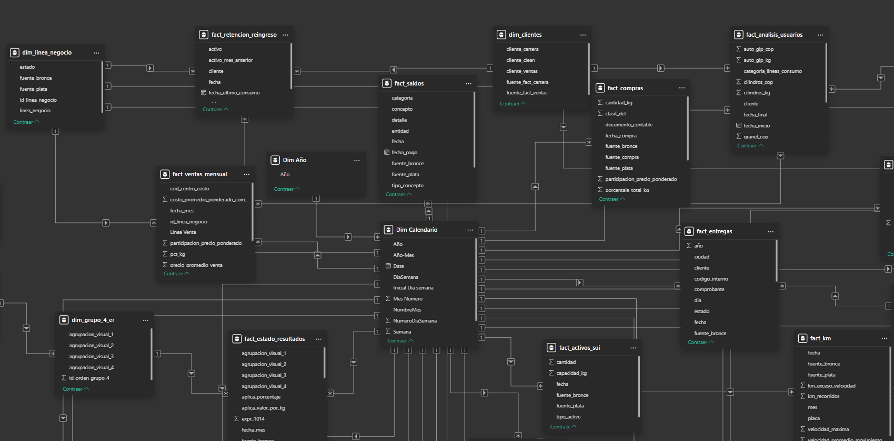

# Modelo Relacional y Medidas

Esta sección presenta la arquitectura del modelo de datos, construida a partir de las tablas procesadas en la fase de transformación, junto con el catálogo de medidas calculadas que dan soporte a las visualizaciones

## Modelo relacional
<br>


<p align="center"><i>Vista parcial del modelo relacional en Power BI </i></p>

### Catálogo de Tablas del Modelo

A continuación se listan todas las tablas que componen el modelo semántico en Power BI, incluyendo las dimensiones, las tablas de hechos (Gold) y las tablas auxiliares de soporte visual y de cálculo.

| Tabla | Descripción |
| :--- | :--- |
| **Dim Calendario** | Tabla de calendario corrida día a día (`Date`) que actúa como eje temporal central del modelo; se relaciona con la mayoría de las tablas de hechos para habilitar Time Intelligence (mismo periodo mes/año anterior, etc.). |
| **Dim Año** | Dimensión auxiliar en estructura copo de nieve que lista los años disponibles en el modelo, usada para normalizar filtros globales de año sobre `Dim Calendario`. |
| **Fecha Actualización** | Tabla de control que almacena la fecha y hora de la última actualización exitosa del modelo, mostrada en el tablero como referencia de vigencia de los datos. |
| **Medidas** | Tabla desconectada (sin datos propios) que actúa como carpeta contenedora de la mayoría de las medidas DAX del modelo, agrupando el catálogo central de KPIs del tablero. |
| **dim_activos_vigigas** | Dimensión maestra de activos (cilindros y tanques) monitoreados por el sistema Vigigas, con su fecha de creación y tipo de activo; alimenta los indicadores de trazabilidad satelital. |
| **dim_grupo_4_er** | Dimensión de agrupación visual de nivel 4 del Estado de Resultados, parte de la jerarquía copo de nieve de cuentas contables (nivel 4 → nivel 3 → nivel 2 → nivel 1). |
| **dim_almacenadoras** | Dimensión maestra de almacenadoras de GLP con su homologación de nombre y capacidad de almacenamiento en kilogramos, usada para relacionar los hechos de almacenamiento e inventario. |
| **dim_centro_costo_auto_glp** | Dimensión maestra de centros de costo del negocio Auto GLP, con su nombre, tipo y línea de venta, usada para segmentar ventas y análisis financiero por centro de costo. |
| **dim_clientes** | Dimensión maestra de clientes (nombre estandarizado `cliente_clean`) usada para relacionar el consumo, la retención y el reingreso de usuarios de las líneas de negocio. |
| **dim_linea_negocio** | Dimensión maestra de líneas de negocio de la compañía (identificador y nombre), usada como filtro transversal en ventas, cartera, telemetría y retención de clientes. |
| **fact_compras** | Tabla de hechos con el detalle de compras de producto GLP (cantidad en kg, valor de compra y precio promedio ponderado), consolidada desde Compras por Producto (World Office). |
| **fact_ventas_mensual** | Tabla de hechos con las ventas mensuales de GLP por línea de negocio y centro de costo (kilos y valor total), base de los indicadores comerciales y de margen. |
| **fact_situacion_financiera** | Tabla de hechos del Balance General (situación financiera) con los saldos por nivel contable, usada para calcular liquidez, endeudamiento y capital de trabajo. |
| **fact_estado_resultados** | Tabla de hechos del Estado de Resultados con los valores contables por cuenta y nivel de agrupación, base de las medidas de utilidad, márgenes y gastos operacionales. |
| **dim_grupo_3_er** | Dimensión de agrupación visual de nivel 3 del Estado de Resultados, parte de la jerarquía copo de nieve de cuentas contables. |
| **dim_grupo_2_er** | Dimensión de agrupación visual de nivel 2 del Estado de Resultados, parte de la jerarquía copo de nieve de cuentas contables. |
| **dim_grupo_1_er** | Dimensión de agrupación visual de nivel 1 del Estado de Resultados (nivel más agregado: utilidad operacional, utilidad antes de impuestos, gastos, etc.). |
| **datos_fuentes_simulador_glp** | Tabla de hechos que consolida las fuentes externas (propano, butano, TRM, costo de embarque) requeridas como insumo para el simulador de precio de suministro de GLP. |
| **fact_simulador_glp** | Tabla de hechos con la serie histórica de precios de GLP calculada por el simulador, base de la medida `Precio Simulado GLP`. |
| **Q1 PP_(m-1)** | Tabla auxiliar desconectada que resuelve el precio de propano del mes anterior (m-1) para la primera quincena simulada del precio de GLP. |
| **Q1 PB_(m_1)** | Tabla auxiliar desconectada que resuelve el precio de butano del mes anterior (m-1) para la primera quincena simulada del precio de GLP. |
| **Q1 TRM_(m-1)** | Tabla auxiliar desconectada que resuelve la Tasa Representativa del Mercado (TRM) del mes anterior (m-1) para la primera quincena simulada del precio de GLP. |
| **Q1 CE_(m-1)** | Tabla auxiliar desconectada que resuelve el costo de embarque del mes anterior (m-1) para la primera quincena simulada del precio de GLP. |
| **Q1 TPCB_(m-1)** | Tabla auxiliar desconectada que resuelve el costo de transporte (TPCB) del mes anterior (m-1) para la primera quincena simulada del precio de GLP. |
| **Calendario Simulador** | Calendario quincenal auxiliar (con índice `Indice_Quincena`) usado exclusivamente por el simulador de precio de GLP para proyectar las dos quincenas futuras. |
| **Q2 PP_(m-1)** | Tabla auxiliar desconectada que resuelve el precio de propano del mes anterior (m-1) para la segunda quincena simulada del precio de GLP. |
| **Q2 PB_(m-1)** | Tabla auxiliar desconectada que resuelve el precio de butano del mes anterior (m-1) para la segunda quincena simulada del precio de GLP. |
| **Q2 TRM_(m-1)** | Tabla auxiliar desconectada que resuelve la TRM del mes anterior (m-1) para la segunda quincena simulada del precio de GLP. |
| **Q2 CE_(m-1)** | Tabla auxiliar desconectada que resuelve el costo de embarque del mes anterior (m-1) para la segunda quincena simulada del precio de GLP. |
| **Q2 TPCB_(m-1)** | Tabla auxiliar desconectada que resuelve el costo de transporte (TPCB) del mes anterior (m-1) para la segunda quincena simulada del precio de GLP. |
| **fact_almacenamiento_por_dia** | Tabla de hechos con el inventario diario de producto por almacenadora (kilogramos y valor en COP almacenado, capacidad disponible), consolidando Mopeka, Web Vision y control diario. |
| **fact_cartera_resumen** | Tabla de hechos con el resumen de cartera por edades y línea de negocio a la fecha de cierre, base de las medidas de cartera total y morosidad. |
| **fact_entregas** | Tabla de hechos con las entregas o suministros realizados por vehículo (placa) de la línea de tanques estacionarios, base de los indicadores de kilos entregados y productividad de flota. |
| **dim_vehiculos** | Dimensión maestra de vehículos (placas) de la flota de distribución, usada para relacionar entregas y kilómetros recorridos de la línea de tanques. |
| **fact_km** | Tabla de hechos con los kilómetros recorridos por vehículo y fecha, usada junto con `fact_entregas` para calcular la productividad de la flota de tanques. |
| **Indicadores Históricos** | Tabla de soporte visual con la serie histórica de indicadores clave del tablero, usada para gráficos comparativos de evolución en el tiempo. |
| **fact_transito_mensual** | Tabla de hechos con los kilos de producto en tránsito hacia las almacenadoras al cierre de cada mes, complementaria al inventario almacenado. |
| **fact_almacenamiento_diario** | Tabla de hechos con los movimientos diarios de almacenamiento (entradas y salidas) por almacenadora, base del cálculo de demanda diaria promedio y cobertura de inventario. |
| **fact_analisis_usuarios** | Tabla de hechos con el consumo y ventas por usuario/cliente en un periodo de análisis, base de las medidas de usuarios únicos e ingreso promedio por usuario. |
| **fact_usuarios_linea** | Tabla de hechos con el consumo de usuarios agrupado por línea de negocio y categoría de consumo, complementaria a `fact_analisis_usuarios`. |
| **dim_categorias_consumo** | Dimensión que clasifica a los clientes según su categoría de consumo (rangos de kilos consumidos), usada para segmentar el análisis de usuarios. |
| **fact_conversion_auto_glp** | Tabla de hechos con el registro de conversiones de vehículos a Auto GLP (estado, usuario, fecha), consolidada desde el formato mensual de Conversión Auto GLP. |
| **fact_retencion_reingreso** | Tabla de hechos que identifica mes a mes si un cliente está activo, si venía activo el mes anterior o si reingresa tras inactividad, base de las medidas de retención y reingreso. |
| **fact_facturacion** | Tabla de hechos con el ciclo de facturación (fechas de inicio y fin de proceso, tipo cliente/proveedor), base de la medida de días promedio de facturación. |
| **fact_rutas_vehiculos** | Tabla de hechos con las visitas, kilómetros recorridos y entregas en radio rentable por vehículo de la línea de distribución Auto GLP, consolidada desde el formato mensual de Rutas Vehículos. |
| **fact_rrhh** | Tabla de hechos con los indicadores mensuales de personal (trabajadores iniciales, ingresos, salidas, errores de nómina), consolidada desde el formato mensual de RRHH. |
| **fact_accidentes** | Tabla de hechos con el registro de accidentes laborales y trabajadores involucrados, consolidada desde el formato mensual de Accidentes. |
| **fact_simulacros** | Tabla de hechos con el registro de simulacros de emergencia realizados y su cumplimiento, consolidada desde el formato mensual de Simulacros. |
| **fact_telemetria** | Tabla de hechos con las mediciones satelitales/telemétricas de nivel de tanques (Mopeka y Web Vision), base del conteo de tanques monitoreados. |
| **fact_invoices_vigigas** | Tabla de hechos con las facturas (invoices) emitidas por el sistema Vigigas para los activos con contrato de suministro, base de los indicadores de ventas y activos vendidos de Vigigas. |
| **fact_registro_vigigas** | Tabla de hechos con el histórico de estados y ubicaciones (trazabilidad geográfica) de los cilindros distribuidos y monitoreados por Vigigas. |
| **fact_activos_sui** | Tabla de hechos con el inventario total de activos (cilindros y tanques) reportado en los informes del SUI, base del universo total de activos de la compañía. |
| **dim_agrup_autoglp_2** | Dimensión de agrupación visual de nivel 2 para el análisis de cuentas de Auto GLP, parte de la jerarquía copo de nieve de agrupaciones Auto GLP. |
| **fact_analisis_autoglp** | Tabla de hechos con el detalle financiero mensual por centro de costo de la línea Auto GLP (ingresos, gastos y costos), base del análisis de utilidad y punto de equilibrio de Auto GLP. |
| **dim_agrup_autoglp_1** | Dimensión de agrupación visual de nivel 1 (más agregado) para el análisis de cuentas de Auto GLP. |
| **dim_agrup_autoglp_conversion** | Dimensión que clasifica las cuentas de Auto GLP aplicables al análisis de conversiones, usada como filtro adicional del análisis financiero de Auto GLP. |
| **fact_saldos** | Tabla de hechos con los saldos de tesorería por categoría, entidad y concepto (bancos, Ecopetrol, crédito), consolidada desde el Formato de Saldos, base de las medidas de liquidez de caja. |


### Matriz de Relaciones del Modelo

En la siguiente tabla se especifica el flujo de filtrado del modelo. Siguiendo las mejores prácticas de Power BI, la **Tabla Origen** representa el lado "Uno" (`1`) (la tabla dimensional que propaga el filtro) y la **Tabla Destino** representa el lado "Varios" (`*`) (la tabla transaccional o intermedia que recibe el filtro). Las relaciones se encuentran agrupadas y ordenadas por relevancia: primero la tabla de tiempo central (`Dim_Calendario`), seguida por el resto de tablas de hechos y dimensiones secundarias.

### Matriz de Relaciones (Perspectiva 1 a Varios)

| Tabla Origen (Lado Uno / `1`) | Tabla Destino (Lado Varios / `*`) | Llave Relacional (Campo Común) | Tipo de Relación (Cardinalidad) | Dirección del Filtro | Descripción / Propósito |
| :--- | :--- | :--- | :--- | :--- | :--- |
| **RELACIONES DE DIM_CALENDARIO** | | | | | |
| **Dim_Calendario** | fact_compras | `Date` --> `fecha_compra` | Uno a Varios (`1:*`) | Única (Origen a Destino) | Relaciona la fecha en que se registran las compras de producto. |
| **Dim_Calendario** | fact_ventas_mensual | `Date` --> `fecha_mes` | Uno a Varios (`1:*`) | Única (Origen a Destino) | Relaciona la fecha en que se registran las ventas de producto. |
| **Dim_Calendario** | fact_estado_resultados | `Date` --> `fecha_mes` | Uno a Varios (`1:*`) | Única (Origen a Destino) | Relaciona la fecha de corte para los estados de resultados. |
| **Dim_Calendario** | fact_situacion_financiera | `Date` --> `fecha_mes` | Uno a Varios (`1:*`) | Única (Origen a Destino) | Relaciona la fecha de corte para los análisis de situación financiera. |
| **Dim_Calendario** | fact_almacenamiento_por_dia | `Date` --> `fecha` | Uno a Varios (`1:*`) | Única (Origen a Destino) | Eje temporal para el registro diario de almacenamiento de producto. |
| **Dim_Calendario** | fact_cartera_resumen | `Date` --> `fecha_cierre` | Uno a Varios (`1:*`) | Única (Origen a Destino) | Relaciona la fecha de corte para el análisis de cartera. |
| **Dim_Calendario** | fact_entregas | `Date` --> `fecha` | Uno a Varios (`1:*`) | Única (Origen a Destino) | Relaciona la fecha de entrega registrada para las rutas de la línea de tanques. |
| **Dim_Calendario** | fact_km | `Date` --> `fecha` | Uno a Varios (`1:*`) | Única (Origen a Destino) | Relaciona la fecha de kilometros recorridos para las rutas de la línea de tanques. |
| **Dim_Calendario** | fact_almacenamiento_diario | `Date` --> `fecha` | Uno a Varios (`1:*`) | Única (Origen a Destino) | Permite identificar los niveles diarios de almacenamiento por almacenadora. |
| **Dim_Calendario** | fact_transito_mensual | `Date` --> `fecha_cierre` | Uno a Varios (`1:*`) | Única (Origen a Destino) | Relaciona la fecha de para los kilos de producto en tránsito |
| **Dim_Calendario** | fact_analisis_usuarios | `Date` --> `fecha_final` | Uno a Varios (`1:*`) | Única (Origen a Destino) | Relaciona la fecha para el análisis de consumo de producto por parte de los usuarios. |
| **Dim_Calendario** | fact_usuarios_linea | `Date` --> `fecha_final` | Uno a Varios (`1:*`) | Única (Origen a Destino) | Relaciona la fecha para el análisis de consumo de producto por parte de los usuarios agrupado por línea de negocio. |
| **Dim_Calendario** | fact_saldos | `Date` --> `fecha` | Uno a Varios (`1:*`) | Única (Origen a Destino) | Línea de tiempo principal para el análisis de saldos. |
| **Dim_Calendario** | fact_retencion_reingreso | `Date` --> `fecha` | Uno a Varios (`1:*`) | Única (Origen a Destino) | Relaciona la fecha para los análisis de retención y reingreso de usuarios. |
| **Dim_Calendario** | fact_facturacion | `fecha_inicio_proceso` --> `Date` | Uno a Varios (`1:*`) | Única (Origen a Destino) | Relaciona la fecha de inicio del proceso de facturación. |
| **Dim_Calendario** | fact_rutas_vehiculos | `fecha` --> `Date` | Uno a Varios (`1:*`) | Única (Origen a Destino) | Relaciona la fecha de las visitas y recorridos de las rutas de distribución Auto GLP. |
| **Dim_Calendario** | fact_rrhh | `mes_liquidado` --> `Date` | Uno a Varios (`1:*`) | Única (Origen a Destino) | Relaciona el mes liquidado de los indicadores de personal. |
| **Dim_Calendario** | fact_accidentes | `fecha` --> `Date` | Uno a Varios (`1:*`) | Única (Origen a Destino) | Relaciona la fecha de ocurrencia de los accidentes laborales. |
| **Dim_Calendario** | fact_simulacros | `fecha` --> `Date` | Uno a Varios (`1:*`) | Única (Origen a Destino) | Relaciona la fecha de realización de los simulacros de emergencia. |
| **Dim_Calendario** | fact_telemetria | `fecha` --> `Date` | Uno a Varios (`1:*`) | Única (Origen a Destino) | Relaciona la fecha de las mediciones satelitales/telemétricas de los tanques. |
| **Dim_Calendario** | fact_invoices_vigigas | `fecha` --> `Date` | Uno a Varios (`1:*`) | Única (Origen a Destino) | Relaciona la fecha de las facturas emitidas por Vigigas. |
| **Dim_Calendario** | fact_registro_vigigas | `fecha_estado` --> `Date` | Uno a Varios (`1:*`) | Única (Origen a Destino) | Relaciona la fecha del estado reportado en la trazabilidad de cilindros Vigigas. |
| **Dim_Calendario** | fact_activos_sui | `fecha` --> `Date` | Uno a Varios (`1:*`) | Única (Origen a Destino) | Relaciona la fecha de corte del inventario total de activos del SUI. |
| **Dim_Calendario** | fact_analisis_autoglp | `fecha_mes` --> `Date` | Uno a Varios (`1:*`) | Única (Origen a Destino) | Relaciona el mes del detalle financiero por centro de costo de Auto GLP. |
| **Dim_Calendario** | fact_conversion_auto_glp | `fecha` --> `Date` | Uno a Varios (`1:*`) | Única (Origen a Destino) | Relaciona la fecha de registro de las conversiones a Auto GLP. |
| **RELACIONES DEL SIMULADOR DE PRECIO GLP** | | | | | |
| **Calendario Simulador** | fact_simulador_glp | `Fecha → fecha` | Uno a Varios (`1:*`) | Única (Origen a Destino) | Calendario quincenal que ordena la serie histórica y proyectada del simulador de precio de GLP. |
| **RELACIONES DE VENTAS, CARTERA, ALMACENAMIENTO Y FLOTA** | | | | | |
| **dim_linea_negocio** | fact_ventas_mensual | `id_linea_negocio` | Uno a Varios (`1:*`) | Única (Origen a Destino) | Segmenta las ventas mensuales por línea de negocio. |
| **dim_centro_costo_auto_glp** | fact_ventas_mensual | `cod_centro_costo` | Uno a Varios (`1:*`) | Única (Origen a Destino) | Asocia las ventas mensuales con su centro de costo Auto GLP. |
| **dim_linea_negocio** | fact_cartera_resumen | `id_linea_negocio` | Uno a Varios (`1:*`) | Única (Origen a Destino) | Segmenta el resumen de cartera por línea de negocio. |
| **dim_almacenadoras** | fact_almacenamiento_por_dia | `almacenadora_homologada` | Uno a Varios (`1:*`) | Única (Origen a Destino) | Asocia el inventario diario con la almacenadora que lo custodia. |
| **dim_almacenadoras** | fact_transito_mensual | `almacenadora_homologada` | Uno a Varios (`1:*`) | Única (Origen a Destino) | Asocia los kilos en tránsito con la almacenadora de destino. |
| **dim_almacenadoras** | fact_almacenamiento_diario | `almacenadora_homologada` | Uno a Varios (`1:*`) | Única (Origen a Destino) | Asocia los movimientos diarios de almacenamiento con la almacenadora correspondiente. |
| **dim_vehiculos** | fact_entregas | `placa` | Uno a Varios (`1:*`) | Única (Origen a Destino) | Identifica el vehículo que realizó cada entrega de la línea de tanques. |
| **dim_vehiculos** | fact_km | `placa` | Uno a Varios (`1:*`) | Única (Origen a Destino) | Identifica el vehículo asociado a cada registro de kilómetros recorridos. |
| **dim_clientes** | fact_analisis_usuarios | `cliente_clean → cliente` | Uno a Varios (`1:*`) | Única (Origen a Destino) | Estandariza el nombre del cliente en el análisis de consumo por usuario. |
| **dim_categorias_consumo** | fact_analisis_usuarios | `categoria_lineas_consumo` | Uno a Varios (`1:*`) | Única (Origen a Destino) | Clasifica el consumo del usuario según su categoría de consumo. |
| **dim_categorias_consumo** | fact_usuarios_linea | `categoria_lineas_consumo` | Uno a Varios (`1:*`) | Única (Origen a Destino) | Clasifica el consumo por línea de negocio según su categoría de consumo. |
| **dim_clientes** | fact_retencion_reingreso | `cliente_clean → cliente` | Uno a Varios (`1:*`) | Única (Origen a Destino) | Estandariza el nombre del cliente en el análisis de retención y reingreso. |
| **dim_linea_negocio** | fact_retencion_reingreso | `id_linea_negocio` | Uno a Varios (`1:*`) | Única (Origen a Destino) | Segmenta la retención y el reingreso de clientes por línea de negocio. |
| **dim_linea_negocio** | fact_telemetria | `id_linea_negocio` | Uno a Varios (`1:*`) | Única (Origen a Destino) | Segmenta las mediciones de telemetría por línea de negocio. |
| **RELACIONES DE TRAZABILIDAD VIGIGAS** | | | | | |
| **dim_activos_vigigas** | fact_invoices_vigigas | `nif → detalle_prefactura_nif` | Uno a Varios (`1:*`) | Única (Origen a Destino) | Vincula cada factura de Vigigas con el activo (cilindro o tanque) que la originó. |
| **dim_activos_vigigas** | fact_registro_vigigas | `nif` | Uno a Varios (`1:*`) | Única (Origen a Destino) | Vincula el histórico de estados y ubicaciones con el activo monitoreado por Vigigas. |
| **RELACIONES DE JERARQUÍA DEL ESTADO DE RESULTADOS** | | | | | |
| **dim_grupo_1_er** | dim_grupo_2_er | `agrupacion_visual_1` | Uno a Varios (`1:*`) | Única (Origen a Destino) | Estructura copo de nieve que consolida el nivel 2 dentro del nivel 1 de agrupación del Estado de Resultados. |
| **dim_grupo_2_er** | dim_grupo_3_er | `agrupacion_visual_2` | Uno a Varios (`1:*`) | Única (Origen a Destino) | Estructura copo de nieve que consolida el nivel 3 dentro del nivel 2 de agrupación del Estado de Resultados. |
| **dim_grupo_3_er** | dim_grupo_4_er | `agrupacion_visual_3` | Uno a Varios (`1:*`) | Única (Origen a Destino) | Estructura copo de nieve que consolida el nivel 4 dentro del nivel 3 de agrupación del Estado de Resultados. |
| **dim_grupo_4_er** | fact_estado_resultados | `agrupacion_visual_4` | Uno a Varios (`1:*`) | Única (Origen a Destino) | Asocia cada movimiento contable del Estado de Resultados con su agrupación visual de nivel 4. |
| **RELACIONES DE ANÁLISIS FINANCIERO AUTO GLP** | | | | | |
| **dim_agrup_autoglp_1** | dim_agrup_autoglp_2 | `agrupacion_visual_1` | Uno a Varios (`1:*`) | Única (Origen a Destino) | Estructura copo de nieve que consolida el nivel 2 dentro del nivel 1 de agrupación de cuentas Auto GLP. |
| **dim_centro_costo_auto_glp** | fact_analisis_autoglp | `cod_centro_costo → cod_centro_costo_principal` | Uno a Varios (`1:*`) | Única (Origen a Destino) | Asocia el detalle financiero mensual con su centro de costo principal de Auto GLP. |
| **dim_agrup_autoglp_2** | fact_analisis_autoglp | `agrupacion_visual_2` | Uno a Varios (`1:*`) | Única (Origen a Destino) | Clasifica cada línea del detalle financiero de Auto GLP según su agrupación visual de nivel 2. |
| **dim_agrup_autoglp_conversion** | fact_analisis_autoglp | `agrupacion_visual_conversion` | Uno a Varios (`1:*`) | Única (Origen a Destino) | Filtra las cuentas de Auto GLP aplicables al análisis de conversiones. |
| **Dim_Año** | Dim_Calendario | `Año` | Uno a Varios (`1:*`) | Única (Origen a Destino) | Estructura Copo de Nieve que normaliza los años para filtros globales rápidos en el calendario. |

---

### Directrices para el Tablero de Power BI

1. **Flujo Natural del Filtro:** Al estructurar la matriz de esta manera, se garantiza visualmente que los filtros fluyan de arriba hacia abajo (desde las dimensiones maestras `1` hacia las tablas transaccionales `*`).
2. **Filtros Cruzados Únicos:** Mantener la dirección en **Única** asegura la salud del modelo semántico y evita la ambigüedad en cálculos complejos de DAX, especialmente al calcular indicadores financieros y de rotación sobre las tablas de hechos.
3. **Llaves Primarias:** Recuerda que todas las tablas listadas en la columna **Tabla Origen (Lado Uno / 1)** deben tener valores estrictamente únicos (sin duplicados) en la columna llave dentro de Power BI para evitar relaciones de muchos a muchos de manera accidental.

## Medidas

Este apartado consolida las expresiones DAX empleadas para construir las métricas claves de rendimiento (KPIs) en el tablero. Las medidas han sido reclasificadas en subgrupos temáticos para optimizar el orden dentro del catálogo de Power BI y garantizar un gobierno de datos claro para los usuarios finales.

---

## 📂 Ventas y Compras de GLP

Listado de indicadores de rendimiento y fórmulas de cálculo asociadas a esta dimensión analítica:

### 📊 Kilos Total Vendidos
**Descripción:** Sumatoria de los kilogramos de GLP vendidos en el periodo, principal medida de volumen comercial.

```dax
Kilos Total Vendidos = 
sum(fact_ventas_mensual[total_kg])
```

### 📊 Precio Promedio de Venta por Kg
**Descripción:** Precio promedio de venta por kilogramo, calculado como el valor total vendido dividido entre los kilos totales vendidos.

```dax
Precio Promedio de Venta por Kg = 
DIVIDE([Ventas GLP en COP],[Kilos Total Vendidos],0)
--sum(fact_ventas[participacion_precio_ponderado])
```

### 📊 Ventas GLP en COP
**Descripción:** Valor total de las ventas de GLP en pesos colombianos (COP) en el periodo seleccionado.

```dax
Ventas GLP en COP = 
sum(fact_ventas_mensual[total_ventas])
```

### 📊 Kilos Total Comprados
**Descripción:** Sumatoria de los kilogramos de producto GLP comprados en el periodo.

```dax
Kilos Total Comprados = 
sum(fact_compras[cantidad_kg])
```

### 📊 Compras GLP en COP
**Descripción:** Valor total de las compras de GLP en pesos colombianos (COP) en el periodo seleccionado.

```dax
Compras GLP en COP = 
sum(fact_compras[total_compra_cop])
```

### 📊 Costo promedio ponderado de compra Kg
**Descripción:** Promedio mensual del costo ponderado de compra por kilogramo, calculado como el promedio de la participación de precio ponderado de cada mes (Año-Mes) del periodo.

```dax
Costo promedio ponderado de compra Kg = 
AVERAGEX(
    VALUES('Dim Calendario'[Año-Mes]),
    CALCULATE( sum(fact_compras[participacion_precio_ponderado]) )
)
```

### 📊 Costo promedio de compra por Kg
**Descripción:** Promedio simple del precio de compra por kilogramo, calculado únicamente sobre las compras con cantidad mayor a cero.

```dax
Costo promedio de compra por Kg = 
CALCULATE(AVERAGE(fact_compras[precio_promedio_compra]),fact_compras[cantidad_kg] > 0 )
```

### 📊 Precio promedio ponderado de venta por Kg
**Descripción:** Promedio mensual del precio ponderado de venta por kilogramo, calculado como el promedio de la participación de precio ponderado de cada mes (Año-Mes) del periodo.

```dax
Precio promedio ponderado de venta por Kg = 
AVERAGEX(
    VALUES('Dim Calendario'[Año-Mes]),
    CALCULATE( SUM(fact_ventas_mensual[participacion_precio_ponderado]) )
)
```

### 📊 Costo Estimado Kilos Total Vendidos
**Descripción:** Costo estimado atribuido a los kilogramos totales vendidos, usado como referencia de costo de producto en el análisis de utilidad bruta de Auto GLP.

```dax
Costo Estimado Kilos Total Vendidos = 
sum(fact_ventas_mensual[valor_costo_cop_estimado])
```

### 📊 Kilos Total Vendidos Ultima Fecha
**Descripción:** Kilos Total Vendidos forzados a la última fecha (mes) del calendario que registra datos, ignorando el filtro activo si este no contiene información.

```dax
Kilos Total Vendidos Ultima Fecha = 
-- 1. Buscamos la fecha máxima en el calendario que realmente contenga datos
VAR UltimaFecha = 
    CALCULATE(
        MAX('Dim Calendario'[Date]),
        FILTER(
            ALLSELECTED('Dim Calendario'),
            NOT(ISBLANK([Kilos Total Vendidos])) 
        )
    )

-- 2. Calculamos tu medida forzando el filtro al Año y Mes de esa última fecha encontrada
RETURN
    CALCULATE(
        [Kilos Total Vendidos],
        ALL('Dim Calendario'), -- Limpia otros filtros de fecha que puedan interferir
        YEAR('Dim Calendario'[Date]) = YEAR(UltimaFecha),
        MONTH('Dim Calendario'[Date]) = MONTH(UltimaFecha)
    )
```

### 📊 Promedio Mensual Kilos comprados
**Descripción:** Promedio mensual de los kilogramos comprados, calculado como el promedio de Kilos Total Comprados por cada mes (Año-Mes) del periodo.

```dax
Promedio Mensual Kilos comprados = 
AVERAGEX(
    VALUES('Dim Calendario'[Año-Mes]), 
    [Kilos Total Comprados]
)
```

---

## 📂 Rentabilidad y Márgenes Comerciales

Listado de indicadores de rendimiento y fórmulas de cálculo asociadas a esta dimensión analítica:

### 📊 Margen Bruto
**Descripción:** Margen bruto comercial por kilogramo, calculado como el promedio mensual de la diferencia entre el precio promedio de venta y el costo promedio ponderado de compra.

```dax
Margen Bruto = 
AVERAGEX(
    VALUES('Dim Calendario'[Año-Mes]),
    [Precio Promedio de Venta por Kg] - [Costo promedio ponderado de compra Kg]
)
```

### 📊 Margen Bruto Mes Anterior
**Descripción:** Valor de **Margen Bruto** desplazado un mes calendario hacia atrás (DATEADD -1 MONTH), usado como referencia para calcular variaciones mes contra mes.

```dax
Margen Bruto Mes Anterior = 
CALCULATE(
    [Margen Bruto], 
    DATEADD('Dim Calendario'[Date], -1, MONTH)
)
```

### 📊 Variación Margen Bruto %
**Descripción:** Variación porcentual de **Margen Bruto** frente a **Margen Bruto Mes Anterior**.

```dax
Variación Margen Bruto % = 
DIVIDE(
    [Margen Bruto] - [Margen Bruto Mes Anterior],
    [Margen Bruto Mes Anterior],
    BLANK()
)
```

### 📊 Margen Bruto Ultimo Mes
**Descripción:** Valor de **Margen Bruto** forzado al último mes del calendario que efectivamente contiene datos, ignorando selecciones de fecha vacías.

```dax
Margen Bruto Ultimo Mes = 
-- 1. Buscamos la fecha máxima en el calendario que realmente contenga datos
VAR UltimaFecha = 
    CALCULATE(
        MAX('Dim Calendario'[Date]),
        FILTER(
            ALLSELECTED('Dim Calendario'),
            NOT(ISBLANK([Margen Bruto])) 
        )
    )

-- 2. Calculamos tu medida forzando el filtro al Año y Mes de esa última fecha encontrada
RETURN
    CALCULATE(
        [Margen Bruto],
        ALL('Dim Calendario'), -- Limpia otros filtros de fecha que puedan interferir
        YEAR('Dim Calendario'[Date]) = YEAR(UltimaFecha),
        MONTH('Dim Calendario'[Date]) = MONTH(UltimaFecha)
    )
```

### 📊 Variacion Margen Bruto % Ultimo Mes
**Descripción:** Variación porcentual de **Margen Bruto** correspondiente al último mes del calendario que efectivamente contiene datos.

```dax
Variacion Margen Bruto % Ultimo Mes = 
-- 1. Buscamos la fecha máxima en el calendario que realmente contenga datos
VAR UltimaFecha = 
    CALCULATE(
        MAX('Dim Calendario'[Date]),
        FILTER(
            ALLSELECTED('Dim Calendario'),
            NOT(ISBLANK([Variación Margen Bruto %])) 
        )
    )

-- 2. Calculamos tu medida forzando el filtro al Año y Mes de esa última fecha encontrada
RETURN
    CALCULATE(
        [Variación Margen Bruto %],
        ALL('Dim Calendario'), -- Limpia otros filtros de fecha que puedan interferir
        YEAR('Dim Calendario'[Date]) = YEAR(UltimaFecha),
        MONTH('Dim Calendario'[Date]) = MONTH(UltimaFecha)
    )
```

### 📊 Utilidad Neta
**Descripción:** Utilidad neta (antes de impuestos) tomada del Estado de Resultados, filtrando la agrupación visual de nivel 1 'UTILIDAD ANTES DE IMPUESTOS'.

```dax
Utilidad Neta = 
CALCULATE(SUM(fact_estado_resultados[total_cop]),dim_grupo_1_er[agrupacion_visual_1] = "UTILIDAD  ANTES DE IMPUESTOS")
```

### 📊 Utilidad Neta Mes Anterior
**Descripción:** Valor de **Utilidad Neta** desplazado un mes calendario hacia atrás (DATEADD -1 MONTH), usado como referencia para calcular variaciones mes contra mes.

```dax
Utilidad Neta Mes Anterior = 
CALCULATE(
    [Utilidad Neta], 
    DATEADD('Dim Calendario'[Date], -1, MONTH)
)
```

### 📊 Variación Utilidad Neta %
**Descripción:** Variación porcentual de **Utilidad Neta** frente a **Utilidad Neta Mes Anterior**.

```dax
Variación Utilidad Neta % = 
DIVIDE(
    [Utilidad Neta] - [Utilidad Neta Mes Anterior],
    abs([Utilidad Neta Mes Anterior]),
    BLANK()
)
```

### 📊 Utilidad Neta por Kg
**Descripción:** Utilidad neta expresada por kilogramo vendido, calculada como la Utilidad Neta dividida entre los Kilos Total Vendidos.

```dax
Utilidad Neta por Kg = 
DIVIDE([Utilidad Neta],[Kilos Total Vendidos],0)
```

---

## 📂 Situación Financiera (Balance y Estado de Resultados)

Listado de indicadores de rendimiento y fórmulas de cálculo asociadas a esta dimensión analítica:

### 📊 Activo Corriente
**Descripción:** Activo corriente del último mes con datos, calculado como el Activo Total menos las cuentas de largo plazo (niveles contables 16, 17 y 19).

```dax
Activo Corriente = 
// 1. Guardamos únicamente el nombre/código del mes más reciente en el contexto
VAR _UltimoMes = MAX('Dim Calendario'[Año-Mes])

RETURN
    CALCULATE(
        // 2. Evaluamos la fórmula matemática directamente aquí para que responda al nuevo contexto
        //CALCULATE(SUM(fact_situacion_financiera[total]), fact_situacion_financiera[nivel_1] = "1")
        [Activo Total]
        - CALCULATE(SUM(fact_situacion_financiera[total]), fact_situacion_financiera[nivel_2] = "16")
        - CALCULATE(SUM(fact_situacion_financiera[total]), fact_situacion_financiera[nivel_2] = "17")
        - CALCULATE(SUM(fact_situacion_financiera[total]), fact_situacion_financiera[nivel_2] = "19"),
        
        // 3. Limpiamos filtros anteriores del calendario y aplicamos solo el del último mes
        ALL('Dim Calendario'),
        'Dim Calendario'[Año-Mes] = _UltimoMes
    )
```

### 📊 Pasivo Corriente
**Descripción:** Pasivo corriente del último mes con datos, calculado como el Pasivo Total menos las obligaciones de largo plazo (acreedores distintos a otros acreedores, ingresos recibidos por anticipado y contratos de leasing no corrientes).

```dax
Pasivo Corriente = 
// 1. Guardamos únicamente el nombre/código del mes más reciente en el contexto
VAR _UltimoMes = MAX('Dim Calendario'[Año-Mes])

RETURN
    CALCULATE(
        // 2. Evaluamos la fórmula matemática directamente aquí para que responda al nuevo contexto
        [Pasivo Total]
        - (-- (Uso de marca (242548) + acreedores de renta (todos los demás excepto otros acreedores)) = Acreedores - otros acreedores (242590)
            CALCULATE(SUM(fact_situacion_financiera[total]), fact_situacion_financiera[nivel_3] = "2425")  -- Acreedores
            - CALCULATE(SUM(fact_situacion_financiera[total]), fact_situacion_financiera[nivel_4] = "242590") -- Otros acredores
        )
        - CALCULATE(SUM(fact_situacion_financiera[total]), fact_situacion_financiera[nivel_3] = "2910")  -- Ingresos recibidos por anticipado
        - CALCULATE(SUM(fact_situacion_financiera[total]), fact_situacion_financiera[nivel_5] = "232203"), -- Contratos leasing. Sin división de no corriente y no corriente
        
        // 3. Limpiamos filtros anteriores del calendario y aplicamos solo el del último mes
        ALL('Dim Calendario'),
        'Dim Calendario'[Año-Mes] = _UltimoMes
    )
```

### 📊 Capital de Trabajo
**Descripción:** Capital de trabajo, calculado como la diferencia entre el Activo Corriente y el Pasivo Corriente.

```dax
Capital de Trabajo = 
[Activo Corriente]-[Pasivo Corriente]
```

### 📊 Capital de Trabajo Mes Anterior
**Descripción:** Valor de **Capital de Trabajo** desplazado un mes calendario hacia atrás (DATEADD -1 MONTH), usado como referencia para calcular variaciones mes contra mes.

```dax
Capital de Trabajo Mes Anterior = 
CALCULATE(
    [Capital de Trabajo], 
    DATEADD('Dim Calendario'[Date], -1, MONTH)
)
```

### 📊 Variación Capital de Trabajo %
**Descripción:** Variación porcentual de **Capital de Trabajo** frente a **Capital de Trabajo Mes Anterior**.

```dax
Variación Capital de Trabajo % = 
DIVIDE(
    [Capital de Trabajo] - [Capital de Trabajo Mes Anterior],
    abs([Capital de Trabajo Mes Anterior]),
    BLANK()
)
```

### 📊 Liquidez Corriente
**Descripción:** Razón de liquidez corriente, calculada como el Activo Corriente dividido entre el Pasivo Corriente.

```dax
Liquidez Corriente = 
DIVIDE([Activo Corriente],[Pasivo Corriente],0)
```

### 📊 Liquidez Corriente Mes Anterior
**Descripción:** Valor de **Liquidez Corriente** desplazado un mes calendario hacia atrás (DATEADD -1 MONTH), usado como referencia para calcular variaciones mes contra mes.

```dax
Liquidez Corriente Mes Anterior = 
CALCULATE(
    [Liquidez Corriente], 
    DATEADD('Dim Calendario'[Date], -1, MONTH)
)
```

### 📊 Variación Liquidez Corriente %
**Descripción:** Variación porcentual de **Liquidez Corriente** frente a **Liquidez Corriente Mes Anterior**.

```dax
Variación Liquidez Corriente % = 
DIVIDE(
    [Liquidez Corriente] - [Liquidez Corriente Mes Anterior],
    abs([Liquidez Corriente Mes Anterior]),
    BLANK()
)
```

### 📊 Activo Total
**Descripción:** Activo total de la compañía en el último mes con datos disponibles, tomado del nivel contable 1 del Balance General.

```dax
Activo Total = 
// 1. Guardamos únicamente el nombre/código del mes más reciente en el contexto
VAR _UltimoMes = MAX('Dim Calendario'[Año-Mes])

RETURN
    CALCULATE(
        // 2. Evaluamos la fórmula matemática directamente aquí para que responda al nuevo contexto
        CALCULATE(SUM(fact_situacion_financiera[total]), fact_situacion_financiera[nivel_1] = "1"),
        
        // 3. Limpiamos filtros anteriores del calendario y aplicamos solo el del último mes
        ALL('Dim Calendario'),
        'Dim Calendario'[Año-Mes] = _UltimoMes
    )
```

### 📊 Pasivo Total
**Descripción:** Pasivo total de la compañía en el último mes con datos disponibles, tomado del nivel contable 2 del Balance General.

```dax
Pasivo Total = 
// 1. Guardamos únicamente el nombre/código del mes más reciente en el contexto
VAR _UltimoMes = MAX('Dim Calendario'[Año-Mes])

RETURN
    CALCULATE(
        // 2. Evaluamos la fórmula matemática directamente aquí para que responda al nuevo contexto
        CALCULATE(SUM(fact_situacion_financiera[total]), fact_situacion_financiera[nivel_1] = "2"), 
        // 3. Limpiamos filtros anteriores del calendario y aplicamos solo el del último mes
        ALL('Dim Calendario'),
        'Dim Calendario'[Año-Mes] = _UltimoMes
    )
```

### 📊 Endeudamiento
**Descripción:** Nivel de endeudamiento de la compañía, calculado como el Pasivo Total dividido entre el Activo Total.

```dax
Endeudamiento = 
DIVIDE([Pasivo Total],[Activo Total],0)
```

### 📊 Endeudamiento Mes Anterior
**Descripción:** Valor de **Endeudamiento** desplazado un mes calendario hacia atrás (DATEADD -1 MONTH), usado como referencia para calcular variaciones mes contra mes.

```dax
Endeudamiento Mes Anterior = 
CALCULATE(
    [Endeudamiento], 
    DATEADD('Dim Calendario'[Date], -1, MONTH)
)
```

### 📊 Variación Endeudamiento %
**Descripción:** Variación porcentual de **Endeudamiento** frente a **Endeudamiento Mes Anterior**.

```dax
Variación Endeudamiento % = 
DIVIDE(
    [Endeudamiento] - [Endeudamiento Mes Anterior],
    abs([Endeudamiento Mes Anterior]),
    BLANK()
)
```

### 📊 Utilidad Operacional
**Descripción:** Utilidad operacional (EBITDA) tomada del Estado de Resultados, filtrando la agrupación visual de nivel 1 'UTILIDAD OPERACIONAL (EBITDA)'.

```dax
Utilidad Operacional = 
CALCULATE(SUM(fact_estado_resultados[total_cop]),dim_grupo_1_er[agrupacion_visual_1] = "UTILIDAD OPERACIONAL (EBITDA)")
```

### 📊 Gastos de Interes
**Descripción:** Gastos financieros por intereses, tomados del Estado de Resultados filtrando la agrupación visual de nivel 4 '5805 INTERESES'.

```dax
Gastos de Interes = 
CALCULATE(SUM(fact_estado_resultados[total_cop]),dim_grupo_4_er[agrupacion_visual_4] = "5805 INTERESES")
```

### 📊 Razón de Cobertura de Interes
**Descripción:** Razón de cobertura de intereses, calculada como la Utilidad Operacional dividida entre los Gastos de Interés.

```dax
Razón de Cobertura de Interes = 
DIVIDE([Utilidad Operacional],[Gastos de Interes],0)
```

### 📊 Razón de Cobertura Mes Anterior
**Descripción:** Valor de **Razón de Cobertura** desplazado un mes calendario hacia atrás (DATEADD -1 MONTH), usado como referencia para calcular variaciones mes contra mes.

```dax
Razón de Cobertura Mes Anterior = 
CALCULATE(
    [Razón de Cobertura de Interes], 
    DATEADD('Dim Calendario'[Date], -1, MONTH)
)
```

### 📊 Variación Razón de Cobertura %
**Descripción:** Variación porcentual de **Razón de Cobertura** frente a **Razón de Cobertura Mes Anterior**.

```dax
Variación Razón de Cobertura % = 
DIVIDE(
    [Razón de Cobertura de Interes] - [Razón de Cobertura Mes Anterior],
    abs([Razón de Cobertura Mes Anterior]),
    BLANK()
)
```

### 📊 Patrimonio Neto
**Descripción:** Patrimonio neto de la compañía en el último mes con datos disponibles, tomado del nivel contable 3 del Balance General.

```dax
Patrimonio Neto = 
// 1. Guardamos únicamente el nombre/código del mes más reciente en el contexto
VAR _UltimoMes = MAX('Dim Calendario'[Año-Mes])

RETURN
    CALCULATE(
        // 2. Evaluamos la fórmula matemática directamente aquí para que responda al nuevo contexto
        CALCULATE(SUM(fact_situacion_financiera[total]), fact_situacion_financiera[nivel_1] = "3"), 
        // 3. Limpiamos filtros anteriores del calendario y aplicamos solo el del último mes
        ALL('Dim Calendario'),
        'Dim Calendario'[Año-Mes] = _UltimoMes
    )
```

### 📊 Rentabilidad sobre Patrimonio
**Descripción:** Rentabilidad sobre el patrimonio (ROE), calculada como la Utilidad Operacional dividida entre el Patrimonio Neto.

```dax
Rentabilidad sobre Patrimonio = 
DIVIDE([Utilidad Operacional],[Patrimonio Neto],0)
```

### 📊 Rentabilidad sobre Activo Total
**Descripción:** Rentabilidad sobre activos (ROA), calculada como la Utilidad Operacional dividida entre el Activo Total.

```dax
Rentabilidad sobre Activo Total = 
DIVIDE([Utilidad Operacional],[Activo Total],0)
```

### 📊 Gastos Operacionales
**Descripción:** Valor total de los gastos operacionales, tomado del Estado de Resultados filtrando la agrupación visual de nivel 1 '5 GASTOS OPERACIONALES'.

```dax
Gastos Operacionales = 
CALCULATE(sum(fact_estado_resultados[total_cop]),fact_estado_resultados[agrupacion_visual_1] = "5 GASTOS OPERACIONALES")
```

### 📊 Gastos Operacionales por Kg
**Descripción:** Gastos operacionales expresados por kilogramo vendido, tomados directamente del Estado de Resultados.

```dax
Gastos Operacionales por Kg = 
CALCULATE(sum(fact_estado_resultados[valor_por_kg]),fact_estado_resultados[agrupacion_visual_1] = "5 GASTOS OPERACIONALES")
```

---

## 📂 Simulador de Precio de Suministro GLP

Listado de indicadores de rendimiento y fórmulas de cálculo asociadas a esta dimensión analítica:

### 📊 Precio Simulado GLP
**Descripción:** Serie de precio de suministro de GLP que muestra el valor histórico real hasta la última quincena reportada y proyecta las dos quincenas futuras mediante el modelo de simulación (fórmula ponderada de propano, butano, TRM, costo de embarque y transporte).

```dax
Precio Simulado GLP = 
-- 1. Buscamos la fecha máxima real reportada (ignorando cualquier filtro del gráfico)
VAR UltimaFechaReal = CALCULATE(MAX(fact_simulador_glp[fecha]), REMOVEFILTERS(fact_simulador_glp))
VAR alpha = 0.45
-- 2. Buscamos cuál es el "Indice_Quincena" exacto de esa última fecha real
VAR UltimoIndiceReal = 
    CALCULATE(
        MAX('Calendario Simulador'[Indice_Quincena]),
        REMOVEFILTERS('Calendario Simulador'),
        'Calendario Simulador'[Date] = UltimaFechaReal
    )

-- 3. Identificamos el índice de la quincena que el gráfico está intentando dibujar
VAR IndiceActual = MAX('Calendario Simulador'[Indice_Quincena])

-- 4. Cálculo con los datos históricos reales
VAR Calculo_Real = 
    sum(fact_simulador_glp[precio_glp_m])

-- 5. Simulación 1 (Para la primera quincena futura)
VAR Calculo_Simulado_1 = 
    0.521*(1-alpha)*[Valor de Q1 TRM_(m-1)]*[Valor de Q1 PP_(m-1)] +0.462*alpha*[Valor de Q1 TRM_(m-1)]*[Valor de Q1 PB_(m_1)] - [Valor de Q1 CE_(m-1)] - [Valor de Q1 TPCB_(m-1)]

-- 6. Simulación 2 (Para la segunda quincena futura)
VAR Calculo_Simulado_2 = 
    0.521*(1-alpha)*[Valor de Q2 TRM_(m-1)]*[Valor de Q2 PP_(m-1)] +0.462*alpha*[Valor de Q2 TRM_(m-1)]*[Valor de Q2 PB_(m-1)] - [Valor de Q2 CE_(m-1)] - [Valor de Q2 TPCB_(m-1)]

-- 7. Lógica de asignación dinámica
RETURN
    IF(
        IndiceActual <= UltimoIndiceReal, 
        Calculo_Real, 
        
        IF(
            IndiceActual = UltimoIndiceReal + 1, 
            Calculo_Simulado_1, 
            
            IF(
                IndiceActual = UltimoIndiceReal + 2, 
                Calculo_Simulado_2, 
                
                BLANK() -- Oculta cualquier quincena más allá de la 2da simulada
            )
        )
    )
```

### 📊 Valor de Q1 PP_(m-1)
**Descripción:** Precio de propano del mes anterior (m-1) resuelto por la tabla auxiliar `Q1 PP_(m-1)`, insumo de la primera quincena del simulador de precio de GLP.

```dax
Valor de Q1 PP_(m-1) = 
SELECTEDVALUE('Q1 PP_(m-1)'[Q1 PP_(m-1)], 998)
```

### 📊 Valor de Q1 PB_(m_1)
**Descripción:** Precio de butano del mes anterior (m-1) resuelto por la tabla auxiliar `Q1 PB_(m_1)`, insumo de la primera quincena del simulador de precio de GLP.

```dax
Valor de Q1 PB_(m_1) = 
SELECTEDVALUE('Q1 PB_(m_1)'[Q1 PB_(m_1)], 998)
```

### 📊 Valor de Q1 TRM_(m-1)
**Descripción:** TRM del mes anterior (m-1) resuelta por la tabla auxiliar `Q1 TRM_(m-1)`, insumo de la primera quincena del simulador de precio de GLP.

```dax
Valor de Q1 TRM_(m-1) = 
SELECTEDVALUE('Q1 TRM_(m-1)'[Q1 TRM_(m-1)], 3500)
```

### 📊 Valor de Q1 CE_(m-1)
**Descripción:** Costo de embarque del mes anterior (m-1) resuelto por la tabla auxiliar `Q1 CE_(m-1)`, insumo de la primera quincena del simulador de precio de GLP.

```dax
Valor de Q1 CE_(m-1) = 
SELECTEDVALUE('Q1 CE_(m-1)'[Q1 CE_(m-1)], 0)
```

### 📊 Valor de Q1 TPCB_(m-1)
**Descripción:** Costo de transporte (TPCB) del mes anterior (m-1) resuelto por la tabla auxiliar `Q1 TPCB_(m-1)`, insumo de la primera quincena del simulador de precio de GLP.

```dax
Valor de Q1 TPCB_(m-1) = 
SELECTEDVALUE('Q1 TPCB_(m-1)'[Q1 TPCB_(m-1)], 500)
```

### 📊 Valor de Q2 PP_(m-1)
**Descripción:** Precio de propano del mes anterior (m-1) resuelto por la tabla auxiliar `Q2 PP_(m-1)`, insumo de la segunda quincena del simulador de precio de GLP.

```dax
Valor de Q2 PP_(m-1) = 
SELECTEDVALUE('Q2 PP_(m-1)'[Q2 PP_(m-1)], 998)
```

### 📊 Valor de Q2 PB_(m-1)
**Descripción:** Precio de butano del mes anterior (m-1) resuelto por la tabla auxiliar `Q2 PB_(m-1)`, insumo de la segunda quincena del simulador de precio de GLP.

```dax
Valor de Q2 PB_(m-1) = 
SELECTEDVALUE('Q2 PB_(m-1)'[Q2 PB_(m-1)], 998)
```

### 📊 Valor de Q2 TRM_(m-1)
**Descripción:** TRM del mes anterior (m-1) resuelta por la tabla auxiliar `Q2 TRM_(m-1)`, insumo de la segunda quincena del simulador de precio de GLP.

```dax
Valor de Q2 TRM_(m-1) = 
SELECTEDVALUE('Q2 TRM_(m-1)'[Q2 TRM_(m-1)], 3500)
```

### 📊 Valor de Q2 CE_(m-1)
**Descripción:** Costo de embarque del mes anterior (m-1) resuelto por la tabla auxiliar `Q2 CE_(m-1)`, insumo de la segunda quincena del simulador de precio de GLP.

```dax
Valor de Q2 CE_(m-1) = 
SELECTEDVALUE('Q2 CE_(m-1)'[Q2 CE_(m-1)], 0)
```

### 📊 Valor de Q2 TPCB_(m-1)
**Descripción:** Costo de transporte (TPCB) del mes anterior (m-1) resuelto por la tabla auxiliar `Q2 TPCB_(m-1)`, insumo de la segunda quincena del simulador de precio de GLP.

```dax
Valor de Q2 TPCB_(m-1) = 
SELECTEDVALUE('Q2 TPCB_(m-1)'[Q2 TPCB_(m-1)], 500)
```

---

## 📂 Inventario y Almacenamiento de Producto

Listado de indicadores de rendimiento y fórmulas de cálculo asociadas a esta dimensión analítica:

### 📊 Nivel Inventario promedio diario Kg
**Descripción:** Promedio diario de los kilogramos de producto almacenados en el periodo seleccionado.

```dax
Nivel Inventario promedio diario Kg = 
AVERAGEX(
    VALUES('Dim Calendario'[Date]), -- O la columna de fecha de tu calendario
    CALCULATE(SUM(fact_almacenamiento_por_dia[kg_almacenados]))
)
```

### 📊 Inventario Producto Kg
**Descripción:** Inventario de producto (en kilogramos) correspondiente al último día con datos disponibles en el calendario, sin importar el filtro de fecha seleccionado.

```dax
Inventario Producto Kg = 
// 1. Dia mas reciente
VAR _UltimoDia = MAX('Dim Calendario'[Date])

RETURN
    CALCULATE(
        // 2. Evaluamos la fórmula matemática directamente aquí para que responda al nuevo contexto
        CALCULATE(SUM(fact_almacenamiento_por_dia[kg_almacenados])),
        
        // 3. Limpiamos filtros anteriores del calendario y aplicamos solo el del último mes
        ALL('Dim Calendario'),
        'Dim Calendario'[Date] = _UltimoDia
    )
```

### 📊 Inventario Producto COP
**Descripción:** Inventario de producto valorizado en pesos colombianos (COP) correspondiente al último día con datos disponibles.

```dax
Inventario Producto COP = 
// 1. Dia mas reciente
VAR _UltimoDia = MAX('Dim Calendario'[Date])

RETURN
    CALCULATE(
        // 2. Evaluamos la fórmula matemática directamente aquí para que responda al nuevo contexto
        CALCULATE(SUM(fact_almacenamiento_por_dia[valor_cop_almacenado])),
        
        // 3. Limpiamos filtros anteriores del calendario y aplicamos solo el del último mes
        ALL('Dim Calendario'),
        'Dim Calendario'[Date] = _UltimoDia
    )
```

### 📊 Capacidad Almacenamiento en Kg
**Descripción:** Capacidad total de almacenamiento en kilogramos reportada para el último día con datos disponibles.

```dax
Capacidad Almacenamiento en Kg = 
// 1. Dia mas reciente
VAR _UltimoDia = MAX('Dim Calendario'[Date])

RETURN
    CALCULATE(
        // 2. Evaluamos la fórmula matemática directamente aquí para que responda al nuevo contexto
        CALCULATE(SUM(fact_almacenamiento_por_dia[capacidad_almacenamiento_kg])),
        
        // 3. Limpiamos filtros anteriores del calendario y aplicamos solo el del último mes
        ALL('Dim Calendario'),
        'Dim Calendario'[Date] = _UltimoDia
    )
```

### 📊 Fecha Inicio
**Descripción:** Fecha inicial del rango de análisis utilizado por las medidas del módulo de inventario y disponibilidad de producto.

```dax
Fecha Inicio = 
CALCULATE(min('Dim Calendario'[Date]),REMOVEFILTERS('Dim Calendario'))
```

### 📊 Fecha Fin
**Descripción:** Fecha final del rango de análisis utilizado por las medidas del módulo de inventario y disponibilidad de producto.

```dax
Fecha Fin = 
CALCULATE(max('Dim Calendario'[Date]),REMOVEFILTERS('Dim Calendario'))
```

### 📊 Inventario Producto Kg Inicial
**Descripción:** Kilogramos de producto disponibles en inventario al inicio del periodo de análisis (Fecha Inicio).

```dax
Inventario Producto Kg Inicial = 
// 1. Dia mas reciente
VAR _PrimerDia = MIN('Dim Calendario'[Date])

RETURN
    CALCULATE(
        // 2. Evaluamos la fórmula matemática directamente aquí para que responda al nuevo contexto
        CALCULATE(SUM(fact_almacenamiento_por_dia[kg_almacenados])),
        
        // 3. Limpiamos filtros anteriores del calendario y aplicamos solo el del primer mes
        ALL('Dim Calendario'),
        'Dim Calendario'[Date] = _PrimerDia
    )
```

### 📊 Inventario Producto COP Inicial
**Descripción:** Valor en COP del inventario de producto disponible al inicio del periodo de análisis (Fecha Inicio).

```dax
Inventario Producto COP Inicial = 
// 1. Dia mas reciente
VAR _PrimerDia = MIN('Dim Calendario'[Date])

RETURN
    CALCULATE(
        // 2. Evaluamos la fórmula matemática directamente aquí para que responda al nuevo contexto
        CALCULATE(SUM(fact_almacenamiento_por_dia[valor_cop_almacenado])),
        
        // 3. Limpiamos filtros anteriores del calendario y aplicamos solo el del primer mes
        ALL('Dim Calendario'),
        'Dim Calendario'[Date] = _PrimerDia
    )
```

### 📊 Total Disponible Adquisición COP
**Descripción:** Valor total en COP disponible para adquisición de producto en el periodo (inventario inicial más entradas).

```dax
Total Disponible Adquisición COP = 
[Inventario Producto COP Inicial] + [Compras GLP en COP]
```

### 📊 Total Disponible Adquisición Kg
**Descripción:** Kilogramos totales disponibles para adquisición de producto en el periodo (inventario inicial más entradas).

```dax
Total Disponible Adquisición Kg = 
[Inventario Producto Kg Inicial] + [Kilos Total Comprados]
```

### 📊 Inventario Producto Kg Entradas
**Descripción:** Kilogramos de producto que ingresaron a las almacenadoras durante el periodo de análisis.

```dax
Inventario Producto Kg Entradas = 
CALCULATE(sum(fact_almacenamiento_diario[kilogramos]),fact_almacenamiento_diario[actividad] = "Entrada")
```

### 📊 Inventario Producto Kg Salidas
**Descripción:** Kilogramos de producto que salieron de las almacenadoras (distribuidos) durante el periodo de análisis.

```dax
Inventario Producto Kg Salidas = 
-CALCULATE(sum(fact_almacenamiento_diario[kilogramos]),fact_almacenamiento_diario[actividad] = "Salida")
```

### 📊 Inventario Producto Kg Transito
**Descripción:** Kilogramos de producto que se encuentran en tránsito hacia las almacenadoras durante el periodo de análisis.

```dax
Inventario Producto Kg Transito = 
sum(fact_transito_mensual[Total (kg)])
```

### 📊 Inventario Producto COP Entradas
**Descripción:** Valor en COP de las entradas de producto a las almacenadoras durante el periodo de análisis.

```dax
Inventario Producto COP Entradas = 
CALCULATE(sum(fact_almacenamiento_diario[valor_cop_estimado]),fact_almacenamiento_diario[actividad] = "Entrada")
```

### 📊 Inventario Producto COP Salidas
**Descripción:** Valor en COP de las salidas de producto (distribuido) durante el periodo de análisis.

```dax
Inventario Producto COP Salidas = 
-CALCULATE(sum(fact_almacenamiento_diario[valor_cop_estimado]),fact_almacenamiento_diario[actividad] = "Salida")
```

### 📊 Inventario Producto COP Transito
**Descripción:** Valor en COP del producto en tránsito hacia las almacenadoras durante el periodo de análisis.

```dax
Inventario Producto COP Transito = 
sum(fact_transito_mensual[valor_cop_estimado])
```

### 📊 Total Almacenado Kg
**Descripción:** Kilogramos totales almacenados al final del periodo de análisis (Fecha Fin).

```dax
Total Almacenado Kg = 
[Inventario Producto Kg Inicial] + [Inventario Producto Kg Entradas] + [Inventario Producto Kg Salidas] + [Inventario Producto Kg Transito]
```

### 📊 Total Almacenado COP
**Descripción:** Valor en COP del total almacenado al final del periodo de análisis (Fecha Fin).

```dax
Total Almacenado COP = 
[Inventario Producto COP Inicial] + [Inventario Producto COP Entradas] + [Inventario Producto COP Salidas] +[Inventario Producto COP Transito]
```

### 📊 Variación Almacenado %
**Descripción:** Variación porcentual del inventario almacenado entre el inicio y el fin del periodo de análisis.

```dax
Variación Almacenado % = 
DIVIDE(
    [Total Almacenado COP] - [Total Disponible Adquisición COP],
    abs([Total Disponible Adquisición COP]),
    BLANK()
)
```

### 📊 Variación Distribuido %
**Descripción:** Variación porcentual del producto distribuido (salidas) entre el inicio y el fin del periodo de análisis.

```dax
Variación Distribuido % = 
DIVIDE(
    [Kilos Total Vendidos] - [Total Almacenado Kg],
    abs([Total Almacenado Kg]),
    BLANK()
)
```

### 📊 Capacidad instalada promedio diario Kg
**Descripción:** Promedio diario de la capacidad instalada de almacenamiento (en kilogramos) en el periodo seleccionado.

```dax
Capacidad instalada promedio diario Kg = 
AVERAGEX(
    VALUES('Dim Calendario'[Date]), -- O la columna de fecha de tu calendario
    CALCULATE(SUM(fact_almacenamiento_por_dia[capacidad_almacenamiento_kg]))
)
```

### 📊 Capacidad de almacenamiento utilizada
**Descripción:** Porcentaje de la capacidad instalada de almacenamiento que se encuentra actualmente ocupado por producto.

```dax
Capacidad de almacenamiento utilizada = 
DIVIDE([Nivel Inventario promedio diario Kg],[Capacidad instalada promedio diario Kg],0)
```

### 📊 % Utilización (Almacenamiento + Transito)
**Descripción:** Porcentaje de utilización de la capacidad instalada considerando tanto el producto almacenado como el que se encuentra en tránsito.

```dax
% Utilización (Almacenamiento + Transito) = 
DIVIDE([Promedio Mensual Kilos comprados],[Capacidad instalada promedio diario Kg + Transito],0)
```

### 📊 Capacidad instalada promedio diario Kg + Transito
**Descripción:** Promedio diario de la capacidad instalada de almacenamiento sumando la capacidad equivalente del producto en tránsito.

```dax
Capacidad instalada promedio diario Kg + Transito = 
[Capacidad instalada promedio diario Kg] + [Inventario Producto Kg Transito]
```

### 📊 Demanda Diaria Promedio Kg
**Descripción:** Demanda diaria promedio de producto, calculada como el total de kilogramos de salida dividido entre el número de días con salidas registradas.

```dax
Demanda Diaria Promedio Kg = 
VAR TotalSalidas = 
    ABS([Inventario Producto Kg Salidas])

VAR DiasConSalidas = 
    CALCULATE(
        DISTINCTCOUNT(fact_almacenamiento_diario[fecha]),
        fact_almacenamiento_diario[actividad] = "Salida"
    )

RETURN
    DIVIDE(TotalSalidas, DiasConSalidas, 0)
```

### 📊 DiasConSalidas
**Descripción:** Número de días distintos en los que se registraron salidas de producto en las almacenadoras durante el periodo.

```dax
DiasConSalidas = 
    CALCULATE(
        DISTINCTCOUNT(fact_almacenamiento_diario[fecha]),
        fact_almacenamiento_diario[actividad] = "Salida"
    )
```

### 📊 Cobertura de Inventario en Días
**Descripción:** Días de cobertura de inventario, calculados como el Inventario Producto Kg dividido entre la Demanda Diaria Promedio Kg.

```dax
Cobertura de Inventario en Días = 
DIVIDE([Inventario Producto Kg],[Demanda Diaria Promedio Kg],BLANK())
```

---

## 📂 Rotación de Producto y Cartera

Listado de indicadores de rendimiento y fórmulas de cálculo asociadas a esta dimensión analítica:

### 📊 % Rotación Producto
**Descripción:** Rotación de producto, calculada como los Kilos Total Vendidos divididos entre la Capacidad de Almacenamiento en Kg.

```dax
% Rotación Producto = 
DIVIDE([Kilos Total Vendidos], [Capacidad Almacenamiento en Kg],0)
```

### 📊 % Rotación Producto Ultimo Mes
**Descripción:** Valor de **% Rotación Producto** forzado al último mes del calendario que efectivamente contiene datos, ignorando selecciones de fecha vacías.

```dax
% Rotación Producto Ultimo Mes = 
-- 1. Buscamos la fecha máxima en el calendario que realmente contenga datos
VAR UltimaFecha = 
    CALCULATE(
        MAX('Dim Calendario'[Date]),
        FILTER(
            ALLSELECTED('Dim Calendario'),
            NOT(ISBLANK([% Rotación Producto])) 
        )
    )

-- 2. Calculamos tu medida forzando el filtro al Año y Mes de esa última fecha encontrada
RETURN
    CALCULATE(
        [% Rotación Producto],
        ALL('Dim Calendario'), -- Limpia otros filtros de fecha que puedan interferir
        YEAR('Dim Calendario'[Date]) = YEAR(UltimaFecha),
        MONTH('Dim Calendario'[Date]) = MONTH(UltimaFecha)
    )
```

### 📊 % Rotación Producto Mes Anterior
**Descripción:** Valor de **% Rotación Producto** desplazado un mes calendario hacia atrás (DATEADD -1 MONTH), usado como referencia para calcular variaciones mes contra mes.

```dax
% Rotación Producto Mes Anterior = 
CALCULATE(
    [% Rotación Producto], 
    DATEADD('Dim Calendario'[Date], -1, MONTH)
)
```

### 📊 Variación % Rotación Producto %
**Descripción:** Variación porcentual de **% Rotación Producto** frente a **% Rotación Producto Mes Anterior**.

```dax
Variación % Rotación Producto % = 
DIVIDE(
    [% Rotación Producto] - [% Rotación Producto Mes Anterior],
    [% Rotación Producto Mes Anterior],
    BLANK()
)
```

### 📊 Variacion Rotación Producto % Ultimo Mes
**Descripción:** Variación porcentual de **Rotación Producto** correspondiente al último mes del calendario que efectivamente contiene datos.

```dax
Variacion Rotación Producto % Ultimo Mes = 
-- 1. Buscamos la fecha máxima en el calendario que realmente contenga datos
VAR UltimaFecha = 
    CALCULATE(
        MAX('Dim Calendario'[Date]),
        FILTER(
            ALLSELECTED('Dim Calendario'),
            NOT(ISBLANK([Variación % Rotación Producto %])) 
        )
    )

-- 2. Calculamos tu medida forzando el filtro al Año y Mes de esa última fecha encontrada
RETURN
    CALCULATE(
        [Variación % Rotación Producto %],
        ALL('Dim Calendario'), -- Limpia otros filtros de fecha que puedan interferir
        YEAR('Dim Calendario'[Date]) = YEAR(UltimaFecha),
        MONTH('Dim Calendario'[Date]) = MONTH(UltimaFecha)
    )
```

### 📊 Cartera Total
**Descripción:** Valor total de la cartera por cobrar en el corte seleccionado, sumatoria de todos los rangos de edad.

```dax
Cartera Total = 
// 1. Guardamos únicamente el nombre/código del mes más reciente en el contexto
VAR _UltimoMes = MAX('Dim Calendario'[Año-Mes])

RETURN
    CALCULATE(
        // 2. Evaluamos la fórmula matemática directamente aquí para que responda al nuevo contexto
        SUM(fact_cartera_resumen[valor_cartera]),
        
        // 3. Limpiamos filtros anteriores del calendario y aplicamos solo el del último mes
        ALL('Dim Calendario'),
        'Dim Calendario'[Año-Mes] = _UltimoMes
    )
```

### 📊 Cartera mayor a 90
**Descripción:** Valor de la cartera con más de 90 días de vencimiento en el corte seleccionado.

```dax
Cartera mayor a 90 = 
CALCULATE(
    [Cartera Total],
    fact_cartera_resumen[edad_cartera] IN { "cartera_91_120", "cartera_mas_121" }
)
```

### 📊 Indice Morosidad
**Descripción:** Índice de morosidad de cartera, calculado como la Cartera mayor a 90 días dividida entre la Cartera Total.

```dax
Indice Morosidad = 
DIVIDE([Cartera mayor a 90],[Cartera Total],0)
```

### 📊 Indice Morosidad Mes Anterior
**Descripción:** Valor de **Indice Morosidad** desplazado un mes calendario hacia atrás (DATEADD -1 MONTH), usado como referencia para calcular variaciones mes contra mes.

```dax
Indice Morosidad Mes Anterior = 
CALCULATE(
    [Indice Morosidad], 
    DATEADD('Dim Calendario'[Date], -1, MONTH)
)
```

### 📊 Variación Indice Morosidad %
**Descripción:** Variación porcentual de **Indice Morosidad** frente a **Indice Morosidad Mes Anterior**.

```dax
Variación Indice Morosidad % = 
DIVIDE(
    [Indice Morosidad] - [Indice Morosidad Mes Anterior],
    abs([Indice Morosidad Mes Anterior]),
    BLANK()
)
```

### 📊 Variacion Indice Morosidad % Ultimo Mes
**Descripción:** Variación porcentual de **Indice Morosidad** correspondiente al último mes del calendario que efectivamente contiene datos.

```dax
Variacion Indice Morosidad % Ultimo Mes = 
-- 1. Buscamos la fecha máxima en el calendario que realmente contenga datos
VAR UltimaFecha = 
    CALCULATE(
        MAX('Dim Calendario'[Date]),
        FILTER(
            ALLSELECTED('Dim Calendario'),
            NOT(ISBLANK([Variación Indice Morosidad %])) 
        )
    )

-- 2. Calculamos tu medida forzando el filtro al Año y Mes de esa última fecha encontrada
RETURN
    CALCULATE(
        [Variación Indice Morosidad %],
        ALL('Dim Calendario'), -- Limpia otros filtros de fecha que puedan interferir
        YEAR('Dim Calendario'[Date]) = YEAR(UltimaFecha),
        MONTH('Dim Calendario'[Date]) = MONTH(UltimaFecha)
    )
```

---

## 📂 Distribución - Flota de Tanques Estacionarios

Listado de indicadores de rendimiento y fórmulas de cálculo asociadas a esta dimensión analítica:

### 📊 Kg Entregados Tanques
**Descripción:** Kilogramos de producto suministrados (entregados) por la flota de tanques estacionarios en el periodo.

```dax
Kg Entregados Tanques = 
sum(fact_entregas[suministro_kg_clean])
```

### 📊 Km Recorridos Tanques
**Descripción:** Kilómetros recorridos por la flota de vehículos de la línea de tanques estacionarios en el periodo.

```dax
Km Recorridos Tanques = 
sum(fact_km[km_recorridos])
```

### 📊 Kg Entregados Promedio Mes
**Descripción:** Promedio mensual de kilogramos entregados por la flota de tanques, calculado como el promedio de Kg Entregados Tanques por cada mes (Año-Mes) del periodo.

```dax
Kg Entregados Promedio Mes = 
AVERAGEX(
    VALUES('Dim Calendario'[Año-Mes]), 
    [Kg Entregados Tanques]
)
```

### 📊 # Vehiculos
**Descripción:** Número de vehículos (placas) distintos que registraron entregas en la línea de tanques estacionarios.

```dax
# Vehiculos = 
DISTINCTCOUNT(fact_entregas[placa])
```

### 📊 Productividad Vehículos Tanques
**Descripción:** Productividad de la flota de tanques, calculada como los Kg Entregados Tanques divididos entre los Km Recorridos Tanques.

```dax
Productividad Vehículos Tanques = 
DIVIDE([Kg Entregados Tanques],[Km Recorridos Tanques],0)
```

### 📊 Productividad Vehiculo Tanques Mes Anterior
**Descripción:** Valor de **Productividad Vehiculo Tanques** desplazado un mes calendario hacia atrás (DATEADD -1 MONTH), usado como referencia para calcular variaciones mes contra mes.

```dax
Productividad Vehiculo Tanques Mes Anterior = 
CALCULATE(
    [Productividad Vehículos Tanques], 
    DATEADD('Dim Calendario'[Date], -1, MONTH)
)
```

### 📊 Variación Productividad Vehículos Tanques %
**Descripción:** Variación porcentual de **Productividad Vehículos Tanques** frente a **Productividad Vehículos Tanques Mes Anterior**.

```dax
Variación Productividad Vehículos Tanques % = 
DIVIDE(
    [Productividad Vehículos Tanques] - [Productividad Vehiculo Tanques Mes Anterior],
    abs([Productividad Vehiculo Tanques Mes Anterior]),
    BLANK()
)
```

### 📊 Productividad por Vehículo Tanques Ultimo Mes
**Descripción:** Valor de **Productividad por Vehículo Tanques** forzado al último mes del calendario que efectivamente contiene datos, ignorando selecciones de fecha vacías.

```dax
Productividad por Vehículo Tanques Ultimo Mes = 
-- 1. Buscamos la fecha máxima en el calendario que realmente contenga datos
VAR UltimaFecha = 
    CALCULATE(
        MAX('Dim Calendario'[Date]),
        FILTER(
            ALLSELECTED('Dim Calendario'),
            NOT(ISBLANK([Productividad Vehículos Tanques])) 
        )
    )

-- 2. Calculamos tu medida forzando el filtro al Año y Mes de esa última fecha encontrada
RETURN
    CALCULATE(
        [Productividad Vehículos Tanques],
        ALL('Dim Calendario'), -- Limpia otros filtros de fecha que puedan interferir
        YEAR('Dim Calendario'[Date]) = YEAR(UltimaFecha),
        MONTH('Dim Calendario'[Date]) = MONTH(UltimaFecha)
    )
```

### 📊 Variacion Productividad Vehículo Tanques % Ultimo Mes
**Descripción:** Variación porcentual de **Productividad Vehículo Tanques** correspondiente al último mes del calendario que efectivamente contiene datos.

```dax
Variacion Productividad Vehículo Tanques % Ultimo Mes = 
-- 1. Buscamos la fecha máxima en el calendario que realmente contenga datos
VAR UltimaFecha = 
    CALCULATE(
        MAX('Dim Calendario'[Date]),
        FILTER(
            ALLSELECTED('Dim Calendario'),
            NOT(ISBLANK([Variación Productividad Vehículos Tanques %])) 
        )
    )

-- 2. Calculamos tu medida forzando el filtro al Año y Mes de esa última fecha encontrada
RETURN
    CALCULATE(
        [Variación Productividad Vehículos Tanques %],
        ALL('Dim Calendario'), -- Limpia otros filtros de fecha que puedan interferir
        YEAR('Dim Calendario'[Date]) = YEAR(UltimaFecha),
        MONTH('Dim Calendario'[Date]) = MONTH(UltimaFecha)
    )
```

---

## 📂 Distribución - Rutas Vehículos Auto GLP

Listado de indicadores de rendimiento y fórmulas de cálculo asociadas a esta dimensión analítica:

### 📊 Total Visitas Rutas
**Descripción:** Número total de visitas realizadas por la flota en las rutas de distribución AutoGLP.

```dax
Total Visitas Rutas = 
sum(fact_rutas_vehiculos[total_visitas])
```

### 📊 Total Visitas con venta o recarga
**Descripción:** Número de visitas efectivas (con venta o recarga) realizadas en las rutas de distribución AutoGLP.

```dax
Total Visitas con venta o recarga = 
sum(fact_rutas_vehiculos[visitas_efectivas])
```

### 📊 Eficiencia de Visitas
**Descripción:** Eficiencia de visitas, calculada como las Visitas con venta o recarga divididas entre el Total de Visitas Rutas.

```dax
Eficiencia de Visitas = 
DIVIDE([Total Visitas con venta o recarga],[Total Visitas Rutas],0)
```

### 📊 Km Recorridos Rutas
**Descripción:** Kilómetros recorridos por la flota en las rutas de distribución AutoGLP.

```dax
Km Recorridos Rutas = 
sum(fact_rutas_vehiculos[km_recorridos])
```

### 📊 Eficiencia de Rutas
**Descripción:** Eficiencia de rutas, calculada como las Visitas con venta o recarga divididas entre los Kilómetros Recorridos en Rutas.

```dax
Eficiencia de Rutas = 
DIVIDE([Total Visitas con venta o recarga],[Km Recorridos Rutas],0)
```

### 📊 Entregas dentro de radio rentable
**Descripción:** Número de entregas realizadas dentro del radio geográfico considerado rentable para la operación.

```dax
Entregas dentro de radio rentable = 
sum(fact_rutas_vehiculos[entregas_radio_rentable])
```

---

## 📂 Usuarios, Retención y Reingreso de Clientes

Listado de indicadores de rendimiento y fórmulas de cálculo asociadas a esta dimensión analítica:

### 📊 Total Usuarios Únicos
**Descripción:** Número de clientes (usuarios) distintos que registraron consumo en el periodo de análisis.

```dax
Total Usuarios Únicos = 
DISTINCTCOUNT(fact_analisis_usuarios[cliente])
```

### 📊 Total Ventas Análisis
**Descripción:** Valor total en COP de las ventas asociadas al análisis de consumo por usuario.

```dax
Total Ventas Análisis = 
sum(fact_analisis_usuarios[total_cop])
```

### 📊 Ingresos promedio por usuario
**Descripción:** Ingreso promedio generado por usuario, calculado como el Total Ventas Análisis dividido entre el Total Usuarios Únicos.

```dax
Ingresos promedio por usuario = 
DIVIDE([Total Ventas Análisis],[Total Usuarios Únicos],0)
```

### 📊 Clientes activos
**Descripción:** Número de clientes distintos marcados como activos en el último mes con datos disponibles.

```dax
Clientes activos = 
// 1. Guardamos únicamente el nombre/código del mes más reciente en el contexto
VAR _UltimoMes = MAX('Dim Calendario'[Año-Mes])

RETURN
    CALCULATE(
        // 2. Evaluamos la fórmula matemática directamente aquí para que responda al nuevo contexto
        CALCULATE(DISTINCTCOUNT(fact_retencion_reingreso[cliente]), fact_retencion_reingreso[activo] = "Si" ),
        
        // 3. Limpiamos filtros anteriores del calendario y aplicamos solo el del último mes
        ALL('Dim Calendario'),
        'Dim Calendario'[Año-Mes] = _UltimoMes
    )
```

### 📊 Clientes retención
**Descripción:** Número de clientes activos en el último mes que ya se encontraban activos el mes anterior (clientes retenidos).

```dax
Clientes retención = 
// 1. Guardamos únicamente el nombre/código del mes más reciente en el contexto
VAR _UltimoMes = MAX('Dim Calendario'[Año-Mes])

RETURN
    CALCULATE(
        // 2. Evaluamos la fórmula matemática directamente aquí para que responda al nuevo contexto
        CALCULATE([Clientes activos], fact_retencion_reingreso[activo_mes_anterior] = "Si" ),
        
        // 3. Limpiamos filtros anteriores del calendario y aplicamos solo el del último mes
        ALL('Dim Calendario'),
        'Dim Calendario'[Año-Mes] = _UltimoMes
    )
```

### 📊 Clientes reingreso
**Descripción:** Número de clientes activos en el último mes que no estaban activos el mes anterior y que no son clientes nuevos (clientes que reingresan).

```dax
Clientes reingreso = 
// 1. Guardamos únicamente el nombre/código del mes más reciente en el contexto
VAR _UltimoMes = MAX('Dim Calendario'[Año-Mes])

RETURN
    CALCULATE(
        // 2. Evaluamos la fórmula matemática directamente aquí para que responda al nuevo contexto
        CALCULATE([Clientes activos], fact_retencion_reingreso[activo_mes_anterior] = "NO", fact_retencion_reingreso[nuevo] = "NO" ),
        
        // 3. Limpiamos filtros anteriores del calendario y aplicamos solo el del último mes
        ALL('Dim Calendario'),
        'Dim Calendario'[Año-Mes] = _UltimoMes
    )
```

### 📊 Retención
**Descripción:** Tasa de retención de clientes, calculada como los Clientes retención divididos entre los Clientes activos.

```dax
Retención = 
DIVIDE([Clientes retención],[Clientes activos],0)
```

### 📊 Reingreso
**Descripción:** Tasa de reingreso de clientes, calculada como los Clientes reingreso divididos entre los Clientes activos.

```dax
Reingreso = 
DIVIDE([Clientes reingreso],[Clientes activos],0)
```

---

## 📂 Activos, Trazabilidad y Rotación (SUI / Vigigas / Telemetría)

Listado de indicadores de rendimiento y fórmulas de cálculo asociadas a esta dimensión analítica:

### 📊 # Cilindros SUI
**Descripción:** Número de cilindros reportados en el inventario total de activos del SUI.

```dax
# Cilindros SUI = 
CALCULATE([Total Activos],fact_activos_sui[tipo_activo] = "Cilindro")
```

### 📊 # Tanques SUI
**Descripción:** Número de tanques reportados en el inventario total de activos del SUI.

```dax
# Tanques SUI = 
CALCULATE([Total Activos],fact_activos_sui[tipo_activo] = "Tanque")
```

### 📊 Total Activos
**Descripción:** Cantidad total de activos (cilindros y tanques) reportados en el SUI para el último mes con datos disponibles.

```dax
Total Activos = 
// 1. Guardamos únicamente el nombre/código del mes más reciente en el contexto
VAR _UltimoMes = MAX('Dim Calendario'[Año-Mes])

RETURN
    CALCULATE(
        // 2. Evaluamos la fórmula matemática directamente aquí para que responda al nuevo contexto
        sum(fact_activos_sui[cantidad]),
        
        // 3. Limpiamos filtros anteriores del calendario y aplicamos solo el del último mes
        ALL('Dim Calendario'),
        'Dim Calendario'[Año-Mes] = _UltimoMes
    )
```

### 📊 # Activos Vigigas
**Descripción:** Número de activos (cilindros y tanques) distintos registrados y monitoreados por el sistema Vigigas.

```dax
# Activos Vigigas = 
DISTINCTCOUNT(fact_registro_vigigas[nif])
```

### 📊 # Tanques Mopeka - Web Vision
**Descripción:** Número de tanques distintos monitoreados por telemetría a través de Mopeka o Web Vision.

```dax
# Tanques Mopeka - Web Vision = 
DISTINCTCOUNT(fact_telemetria[nombre_estacion_tanque]) 
```

### 📊 Activos con Trazabilidad
**Descripción:** Total de activos que cuentan con algún mecanismo de trazabilidad, sumando los activos Vigigas y los tanques monitoreados por Mopeka/Web Vision.

```dax
Activos con Trazabilidad = 
[# Activos Vigigas] + [# Tanques Mopeka - Web Vision]
```

### 📊 Trazabilidad Activos
**Descripción:** Porcentaje de activos con trazabilidad frente al Total de Activos reportado en el SUI.

```dax
Trazabilidad Activos = 
DIVIDE([Activos con Trazabilidad],[Total Activos],0)
```

### 📊 # Almacenadoras
**Descripción:** Número de almacenadoras homologadas distintas que registraron inventario en el periodo.

```dax
# Almacenadoras = 
DISTINCTCOUNT(fact_almacenamiento_por_dia[almacenadora_homologada])
```

### 📊 # Cilindros Vigigas
**Descripción:** Número de cilindros distintos registrados y monitoreados por Vigigas.

```dax
# Cilindros Vigigas = 
CALCULATE([# Activos Vigigas],dim_activos_vigigas[tipo_activo] = "Cilindro")
```

### 📊 % Cilindros Registrados
**Descripción:** Porcentaje de cilindros monitoreados por Vigigas frente al total de cilindros reportado en el SUI.

```dax
% Cilindros Registrados = 
DIVIDE([# Cilindros Vigigas],[# Cilindros SUI],0)
```

### 📊 # Cilindros vendidos
**Descripción:** Número de cilindros que registraron una venta/factura a través de Vigigas.

```dax
# Cilindros vendidos = 
--COUNT(fact_invoices_vigigas[detalle_prefactura_nif])
CALCULATE([# Activos vendidos Vigigas],dim_activos_vigigas[tipo_activo] = "Cilindro")
```

### 📊 % Rotación Cilindros (Vigigas)
**Descripción:** Rotación de cilindros calculada frente al universo de cilindros monitoreados por Vigigas (cilindros vendidos / cilindros Vigigas).

```dax
% Rotación Cilindros (Vigigas) = 
DIVIDE([# Cilindros vendidos],[# Cilindros Vigigas],0)
```

### 📊 % Rotación Cilindros (SUI)
**Descripción:** Rotación de cilindros calculada frente al universo total de cilindros reportado en el SUI (cilindros vendidos / cilindros SUI).

```dax
% Rotación Cilindros (SUI) = 
DIVIDE([# Cilindros vendidos],[# Cilindros SUI],0)
```

### 📊 # Tanques Vigigas
**Descripción:** Número de tanques distintos registrados y monitoreados por Vigigas.

```dax
# Tanques Vigigas = 
CALCULATE([# Activos Vigigas],dim_activos_vigigas[tipo_activo] = "Tanque")
```

### 📊 # Tanques Monitoreados
**Descripción:** Total de tanques monitoreados, sumando los tanques Vigigas y los tanques Mopeka/Web Vision.

```dax
# Tanques Monitoreados = 
[# Tanques Vigigas] + [# Tanques Mopeka - Web Vision]
```

### 📊 % Tanques Monitoreados
**Descripción:** Porcentaje de tanques monitoreados frente al total de tanques reportado en el SUI.

```dax
% Tanques Monitoreados = 
DIVIDE([# Tanques Monitoreados],[# Tanques SUI],0)
```

### 📊 # Activos vendidos Vigigas
**Descripción:** Número de facturas (activos) registradas en las prefacturas de Vigigas.

```dax
# Activos vendidos Vigigas = 
COUNT(fact_invoices_vigigas[detalle_prefactura_nif])
```

### 📊 # Tanques vendidos
**Descripción:** Número de clientes distintos con entregas registradas en la línea de tanques estacionarios.

```dax
# Tanques vendidos = 
--CALCULATE([# Activos vendidos Vigigas],dim_activos_vigigas[tipo_activo] = "Tanque")
count(fact_entregas[cliente])
```

### 📊 % Tanques con ventas
**Descripción:** Porcentaje de tanques con ventas registradas frente al total de tanques reportado en el SUI.

```dax
% Tanques con ventas = 
DIVIDE([# Tanques vendidos],[# Tanques SUI],0)
```

---

## 📂 Facturación (Tiempos de Proceso)

Listado de indicadores de rendimiento y fórmulas de cálculo asociadas a esta dimensión analítica:

### 📊 Días promedio facturación
**Descripción:** Promedio de días que toma el ciclo completo de facturación, sin distinguir tipo de contraparte.

```dax
Días promedio facturación = 
AVERAGE(fact_facturacion[Días facturación])
```

### 📊 Días promedio facturación cliente
**Descripción:** Promedio de días del ciclo de facturación correspondiente a facturas de tipo Cliente.

```dax
Días promedio facturación cliente = 
CALCULATE([Días promedio facturación],fact_facturacion[tipo_factura] = "Cliente")
```

### 📊 Días promedio facturación proveedor
**Descripción:** Promedio de días del ciclo de facturación correspondiente a facturas de tipo Proveedor.

```dax
Días promedio facturación proveedor = 
CALCULATE([Días promedio facturación],fact_facturacion[tipo_factura] = "Proveedor")
```

---

## 📂 Gestión Humana y Seguridad Industrial

Listado de indicadores de rendimiento y fórmulas de cálculo asociadas a esta dimensión analítica:

### 📊 Total Trabajadores
**Descripción:** Número total de trabajadores activos en el último mes con datos disponibles.

```dax
Total Trabajadores = 
// 1. Guardamos únicamente el nombre/código del mes más reciente en el contexto
VAR _UltimoMes = MAX('Dim Calendario'[Año-Mes])

RETURN
    CALCULATE(
        // 2. Evaluamos la fórmula matemática directamente aquí para que responda al nuevo contexto
        SUM(fact_rrhh[total_trabajadores]),
        
        // 3. Limpiamos filtros anteriores del calendario y aplicamos solo el del último mes
        ALL('Dim Calendario'),
        'Dim Calendario'[Año-Mes] = _UltimoMes
    )
```

### 📊 Trabajadores en Accidentes
**Descripción:** Número de trabajadores involucrados en accidentes laborales en el último mes con datos disponibles.

```dax
Trabajadores en Accidentes = 
// 1. Guardamos únicamente el nombre/código del mes más reciente en el contexto
VAR _UltimoMes = MAX('Dim Calendario'[Año-Mes])

RETURN
    CALCULATE(
        // 2. Evaluamos la fórmula matemática directamente aquí para que responda al nuevo contexto
        SUM(fact_accidentes[numero_trabajadores_involucrados]),
        
        // 3. Limpiamos filtros anteriores del calendario y aplicamos solo el del último mes
        ALL('Dim Calendario'),
        'Dim Calendario'[Año-Mes] = _UltimoMes
    )
```

### 📊 Indice de accidentes
**Descripción:** Índice de accidentalidad, calculado como los Trabajadores en Accidentes divididos entre el Total de Trabajadores.

```dax
Indice de accidentes = 
DIVIDE([Trabajadores en Accidentes],[Total Trabajadores],0)
```

### 📊 Total Simulacros
**Descripción:** Número total de simulacros de emergencia registrados en el periodo.

```dax
Total Simulacros = 
count(fact_simulacros[id_registro])
```

### 📊 Simulacros Realizados
**Descripción:** Número de simulacros que efectivamente se cumplieron en el periodo.

```dax
Simulacros Realizados = 
CALCULATE([Total Simulacros],fact_simulacros[cumplimiento] = "Si")
```

### 📊 Cumplimiento de Simulacros
**Descripción:** Porcentaje de cumplimiento de simulacros, calculado como los Simulacros Realizados divididos entre el Total de Simulacros.

```dax
Cumplimiento de Simulacros = 
DIVIDE([Simulacros Realizados],[Total Simulacros],0)
```

### 📊 Trabajadores que salen
**Descripción:** Número de trabajadores que salieron de la compañía en el último mes con datos disponibles.

```dax
Trabajadores que salen = 
// 1. Guardamos únicamente el nombre/código del mes más reciente en el contexto
VAR _UltimoMes = MAX('Dim Calendario'[Año-Mes])

RETURN
    CALCULATE(
        // 2. Evaluamos la fórmula matemática directamente aquí para que responda al nuevo contexto
        SUM(fact_rrhh[trabajadores_que_salen]),
        
        // 3. Limpiamos filtros anteriores del calendario y aplicamos solo el del último mes
        ALL('Dim Calendario'),
        'Dim Calendario'[Año-Mes] = _UltimoMes
    )
```

### 📊 Tasa de rotación de trabajadores
**Descripción:** Tasa de rotación de personal, calculada como los Trabajadores que salen divididos entre el Total de Trabajadores.

```dax
Tasa de rotación de trabajadores = 
DIVIDE([Trabajadores que salen],[Total Trabajadores],0)
```

### 📊 Errores de Nómina
**Descripción:** Número de errores de nómina reportados en el periodo.

```dax
Errores de Nómina = 
sum(fact_rrhh[errores_nomina])
```

---

## 📂 Centro de Costo y Punto de Equilibrio Auto GLP

Listado de indicadores de rendimiento y fórmulas de cálculo asociadas a esta dimensión analítica:

### 📊 Centro Costo Ingresos Netos Auto GLP
**Descripción:** Ingresos netos de la línea Auto GLP por centro de costo, tomados de la agrupación visual de nivel 1 '4 INGRESOS' del análisis financiero de Auto GLP.

```dax
Centro Costo Ingresos Netos Auto GLP = 
--CALCULATE(sum(fact_centro_costos[total]),fact_centro_costos[nombre_cuenta_nivel_1] = "4 INGRESOS")
CALCULATE(sum(fact_analisis_autoglp[total_cop]),fact_analisis_autoglp[nombre_cuenta_nivel_1] = "4 INGRESOS")
```

### 📊 Centro Costo % Costo Producto
**Descripción:** Porcentaje que representa el Costo Estimado de los Kilos Vendidos frente a los Ingresos Netos de Auto GLP.

```dax
Centro Costo % Costo Producto = 
DIVIDE([Costo Estimado Kilos Total Vendidos],[Centro Costo Ingresos Netos Auto GLP],BLANK())
```

### 📊 Centro costo Utilidad Bruta
**Descripción:** Utilidad bruta de Auto GLP, calculada como los Ingresos Netos menos el Costo Estimado de los Kilos Vendidos.

```dax
Centro costo Utilidad Bruta = 
[Centro Costo Ingresos Netos Auto GLP]-[Costo Estimado Kilos Total Vendidos]
```

### 📊 Centro costo % Utilidad Bruta
**Descripción:** Porcentaje de utilidad bruta de Auto GLP sobre los Ingresos Netos.

```dax
Centro costo % Utilidad Bruta = 
[Centro Costo Ingresos Netos Auto GLP]/[Centro Costo Ingresos Netos Auto GLP]-[Centro Costo % Costo Producto]
```

### 📊 Centro Costo Gastos Adm y Op Auto GLP
**Descripción:** Gastos administrativos, de ventas/operación y de producción de Auto GLP, tomados de las agrupaciones visuales de nivel 1 '5 GASTOS', '6 COSTOS DE VENTAS Y OPERACIÓN' y '7 COSTOS DE PRODUCCIÓN'.

```dax
Centro Costo Gastos Adm y Op Auto GLP = 
CALCULATE(
    --SUM(fact_centro_costos[total]),
    sum(fact_analisis_autoglp[total_cop]),
    --fact_centro_costos[nombre_cuenta_nivel_1] IN {
    fact_analisis_autoglp[nombre_cuenta_nivel_1] IN {
        "5 GASTOS",
        "6 COSTOS DE VENTAS Y OPERACIÓN",
        "7 COSTOS DE PRODUCCIÓN"
    }
)
```

### 📊 Centro costo Utilidad Operacional
**Descripción:** Utilidad operacional de Auto GLP, calculada como la Utilidad Bruta más los Gastos Administrativos y Operacionales (estos últimos ya registrados en negativo).

```dax
Centro costo Utilidad Operacional = 
[Centro costo Utilidad Bruta] + [Centro Costo Gastos Adm y Op Auto GLP]
```

### 📊 Centro costo % Utilidad Operacional
**Descripción:** Porcentaje de utilidad operacional de Auto GLP sobre los Ingresos Netos.

```dax
Centro costo % Utilidad Operacional = 
[Centro costo Utilidad Operacional]/[Centro Costo Ingresos Netos Auto GLP]
```

### 📊 Centro costo asignaciones indirectas
**Descripción:** Valor de las asignaciones indirectas por prorrateo cargadas al centro de costo de Auto GLP.

```dax
Centro costo asignaciones indirectas = 
CALCULATE(sum(fact_analisis_autoglp[total_cop]), fact_analisis_autoglp[agrupacion_visual_1] = "Asignaciones indirectas por prorrateo" )
```

### 📊 Centro costo Resultado Neto
**Descripción:** Resultado neto de Auto GLP, calculado como la Utilidad Operacional menos las asignaciones indirectas por prorrateo.

```dax
Centro costo Resultado Neto = 
[Centro costo Utilidad Operacional] - [Centro costo asignaciones indirectas]
```

### 📊 Centro costo % Resultado Neto
**Descripción:** Porcentaje de resultado neto de Auto GLP sobre los Ingresos Netos.

```dax
Centro costo % Resultado Neto = 
[Centro costo Resultado Neto]/[Centro Costo Ingresos Netos Auto GLP]
```

### 📊 Centro costo asignaciones indirectas por Kg
**Descripción:** Asignaciones indirectas por prorrateo expresadas por kilogramo vendido.

```dax
Centro costo asignaciones indirectas por Kg = 
DIVIDE([Centro costo asignaciones indirectas],[Kilos Total Vendidos],0)
```

### 📊 Centro costo Resultado Neto por Kg
**Descripción:** Resultado neto de Auto GLP expresado por kilogramo vendido.

```dax
Centro costo Resultado Neto por Kg = 
DIVIDE([Centro costo Resultado Neto],[Kilos Total Vendidos],0)
```

### 📊 Centro costo Kilos punto equilibrio
**Descripción:** Kilogramos que se deben vender para alcanzar el punto de equilibrio, calculados a partir de los gastos administrativos y operacionales, el costo estimado y las asignaciones indirectas, divididos entre el Margen Bruto.

```dax
Centro costo Kilos punto equilibrio = 
DIVIDE(-[Centro Costo Gastos Adm y Op Auto GLP]+[Costo Estimado Kilos Total Vendidos]+[Centro costo asignaciones indirectas],[Margen Bruto],0)
```

### 📊 Centro costo Brecha Kilos
**Descripción:** Brecha en kilogramos entre el punto de equilibrio calculado y los Kilos Total Vendidos.

```dax
Centro costo Brecha Kilos = 
[Centro costo Kilos punto equilibrio] - [Kilos Total Vendidos]
```

### 📊 Centro costo % Brecha Kilos
**Descripción:** Brecha de kilogramos frente al punto de equilibrio, expresada como porcentaje de los Kilos Total Vendidos.

```dax
Centro costo % Brecha Kilos = 
DIVIDE([Centro costo Brecha Kilos],[Kilos Total Vendidos],BLANK())
```

### 📊 Costos adicionales por Kg
**Descripción:** Promedio mensual de los gastos operacionales expresados por kilogramo, tomados del Estado de Resultados.

```dax
Costos adicionales por Kg = 
AVERAGEX(
    VALUES('Dim Calendario'[Año-Mes]),
    CALCULATE( SUM(fact_estado_resultados[valor_por_kg]),fact_estado_resultados[agrupacion_visual_1] = "5 GASTOS OPERACIONALES" )
)
```

### 📊 Landing Costo por Kg
**Descripción:** Costo total de aterrizaje (landing cost) por kilogramo, calculado como el Costo promedio ponderado de compra más los Costos adicionales por Kg.

```dax
Landing Costo por Kg = 
[Costo promedio ponderado de compra Kg] + [Costos adicionales por Kg]
```

---

## 📂 Tesorería y Saldos de Caja

Listado de indicadores de rendimiento y fórmulas de cálculo asociadas a esta dimensión analítica:

### 📊 Saldos Bancarios
**Descripción:** Saldo total en cuentas bancarias al último día con datos disponibles, filtrando la categoría 'Bancos' y el tipo de concepto 'Saldos'.

```dax
Saldos Bancarios = 
// 1. Guardamos únicamente el nombre/código del mes más reciente en el contexto
VAR _UltimoDia = MAX(fact_saldos[fecha])--MAX('Dim Calendario'[Date])

RETURN
    CALCULATE(
        // 2. Evaluamos la fórmula matemática directamente aquí para que responda al nuevo contexto
        CALCULATE(sum(fact_saldos[valor]),fact_saldos[categoria] = "Bancos",fact_saldos[tipo_concepto] = "Saldos" ),
        
        // 3. Limpiamos filtros anteriores del calendario y aplicamos solo el del último mes
        ALL('Dim Calendario'),
        'Dim Calendario'[Date] = _UltimoDia
    )
```

### 📊 Fiducuenta
**Descripción:** Saldo total en la fiducuenta (incluyendo rentabilidad generada) al último día con datos disponibles.

```dax
Fiducuenta = 
// 1. Guardamos únicamente el nombre/código del mes más reciente en el contexto
VAR _UltimoDia = MAX(fact_saldos[fecha])--MAX('Dim Calendario'[Date])

RETURN
    CALCULATE(
        // 2. Evaluamos la fórmula matemática directamente aquí para que responda al nuevo contexto
        CALCULATE(sum(fact_saldos[valor]),fact_saldos[categoria] = "Bancos",fact_saldos[tipo_concepto] = "Saldos", fact_saldos[detalle] = "Fiducuenta" )
        +
        CALCULATE(sum(fact_saldos[valor]),fact_saldos[categoria] = "Bancos",fact_saldos[tipo_concepto] = "Rentabilidad" ),
        
        // 3. Limpiamos filtros anteriores del calendario y aplicamos solo el del último mes
        ALL('Dim Calendario'),
        'Dim Calendario'[Date] = _UltimoDia
    )
```

### 📊 Saldos Ecopetrol
**Descripción:** Saldo total con Ecopetrol al último día con datos disponibles.

```dax
Saldos Ecopetrol = 
// 1. Guardamos únicamente el nombre/código del mes más reciente en el contexto
VAR _UltimoDia = MAX(fact_saldos[fecha])--MAX('Dim Calendario'[Date])

RETURN
    CALCULATE(
        // 2. Evaluamos la fórmula matemática directamente aquí para que responda al nuevo contexto
        CALCULATE(sum(fact_saldos[valor]),fact_saldos[categoria] = "Ecopetrol"),
        
        // 3. Limpiamos filtros anteriores del calendario y aplicamos solo el del último mes
        ALL('Dim Calendario'),
        'Dim Calendario'[Date] = _UltimoDia
    )
```

### 📊 Cuentas por pagar
**Descripción:** Valor de las cuentas por pagar (crédito) al último día con datos disponibles, presentado en signo positivo.

```dax
Cuentas por pagar = 
// 1. Guardamos únicamente el nombre/código del mes más reciente en el contexto
VAR _UltimoDia = MAX(fact_saldos[fecha])--MAX('Dim Calendario'[Date])

RETURN
    CALCULATE(
        // 2. Evaluamos la fórmula matemática directamente aquí para que responda al nuevo contexto
        -CALCULATE(sum(fact_saldos[valor]),fact_saldos[categoria] = "Credito"),
        
        // 3. Limpiamos filtros anteriores del calendario y aplicamos solo el del último mes
        ALL('Dim Calendario'),
        'Dim Calendario'[Date] = _UltimoDia
    )
```

---

## 📂 Medidas Auxiliares de Control

Listado de indicadores de rendimiento y fórmulas de cálculo asociadas a esta dimensión analítica:

### 📊 Fecha Cierre Indicadores
**Descripción:** Fecha máxima disponible en `Dim Calendario` ignorando cualquier filtro activo; se usa como referencia de corte para tarjetas y títulos del tablero.

```dax
Fecha Cierre Indicadores = 
CALCULATE(max('Dim Calendario'[Date]),REMOVEFILTERS('Dim Calendario'))
```

