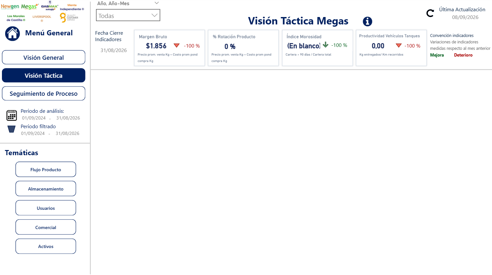
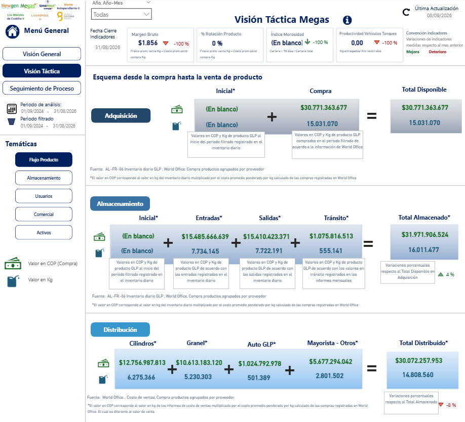
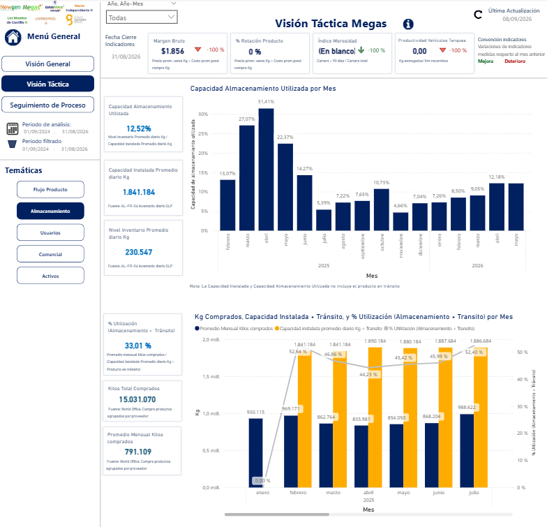
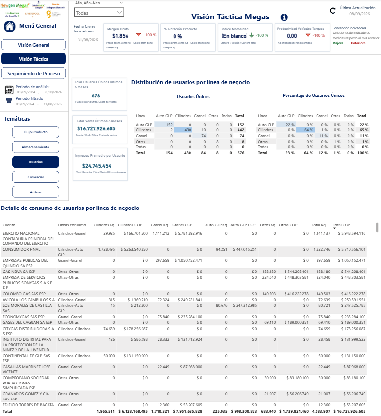
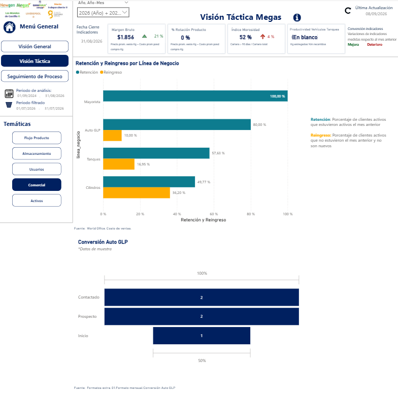
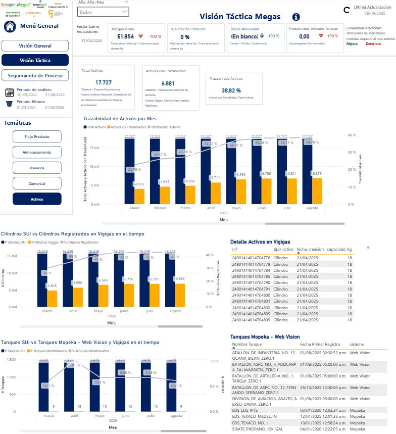

# Visión Táctica

El objetivo de esta hoja es presentar un análisis de la gestión de los procesos *core* del grupo empresarial **MEGAS**, permitiendo un diagnóstico rápido del estado actual del negocio. La interfaz se divide en las siguientes áreas clave:

* **Panel Lateral Izquierdo:** Aloja el menú general de navegación e indica tanto el periodo total de análisis cargado en el modelo como el periodo actualmente filtrado. También incluye un submenú para alternar entre diferentes temáticas de análisis.
* **Barra de Filtros (Superior):** Dispone de segmentadores globales para ajustar la vista por: *Año-Mes*.
* **Tarjetas de Indicadores (KPIs):** Ubicadas inmediatamente debajo de los filtros, muestran el resumen numérico de las métricas clave y la última fecha de actualización del tablero.

 

<i>Menú principal de Visión Táctica </i>

Esta vista contiene las siguientes temáticas:

## Flujo Producto

Presenta un esquema que permite comparar los kilogramos y el valor del producto GLP en sus etapas de adquisición, almacenamiento y distribución.

 

<i>Vista de Flujo Producto</i>

## Almacenamiento

Muestra la evolución de la capacidad de almacenamiento utilizada, la capacidad instalada promedio diaria (en kg) y el nivel de inventario promedio (en kg) a lo largo del tiempo.

 

<i>Vista de Almacenamiento</i>

## Usuarios

Ofrece un análisis detallado de los usuarios segmentado por línea de negocio, junto con sus consumos registrados durante los últimos 6 meses.

 

<i>Vista de Usuarios</i>

## Comercial

Ilustra el comportamiento histórico de las siguientes métricas comerciales:

- **Retención:** Porcentaje de clientes activos que también registraron actividad el mes anterior.
- **Reingreso:** Porcentaje de clientes activos que no estuvieron presentes el mes anterior, excluyendo a los clientes nuevos.
- **Conversión Auto GLP:** Tasa de conversión para esta línea (nota: los valores mostrados corresponden a datos de muestra).

 

<i>Vista de Comercial</i>

## Activos

Detalla el inventario total de activos (cilindros y tanques estacionarios) e identifica cuáles de ellos cuentan actualmente con trazabilidad dentro de algún sistema de la organización.

 

<i>Vista de Activos</i>
