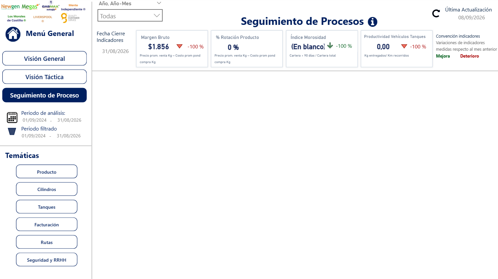
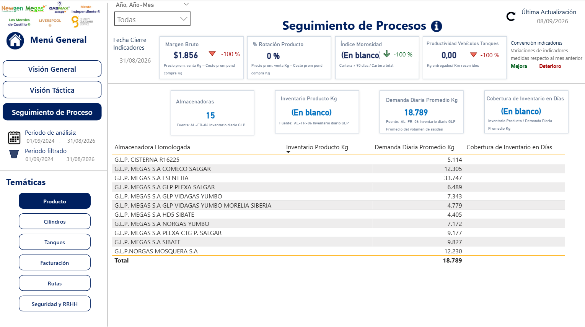
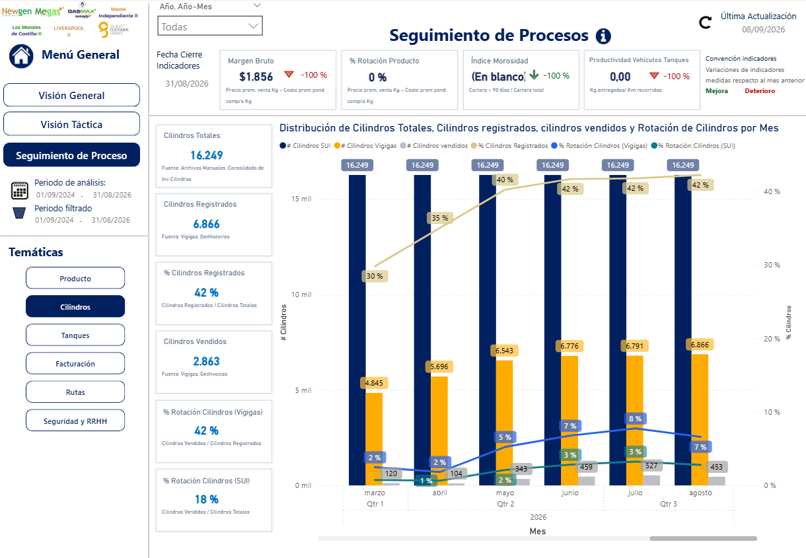
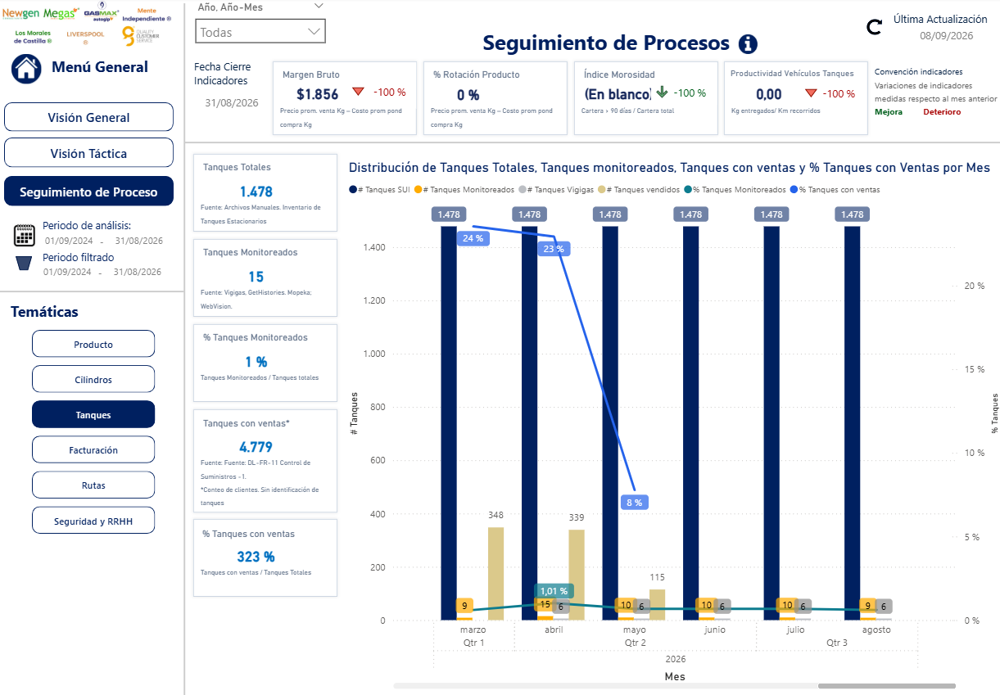
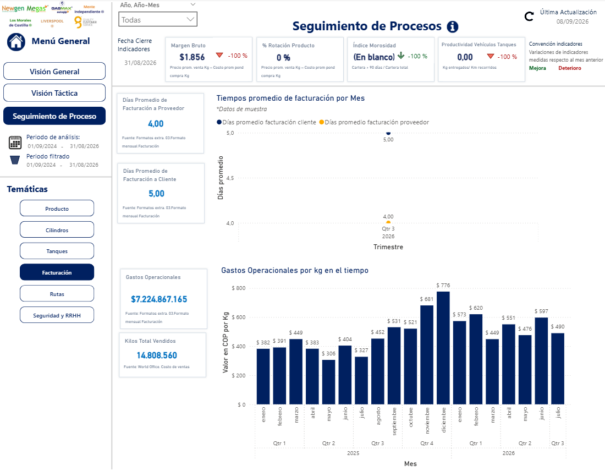
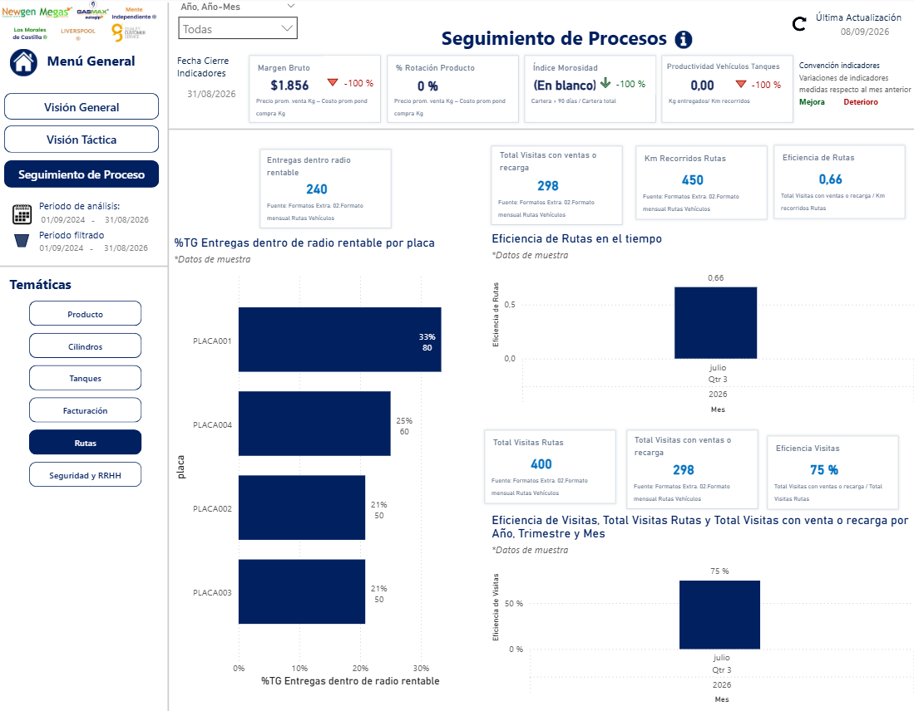

# Seguimiento de proceso

El objetivo de esta sección es presentar un seguimiento detallado y granular de los procesos operativos de **MEGAS**, a partir de la información disponible. La interfaz se divide en las siguientes áreas clave:

* **Panel Lateral Izquierdo:** Aloja el menú general de navegación e indica tanto el periodo total de análisis cargado en el modelo como el periodo actualmente filtrado. También incluye un submenú para alternar entre diferentes temáticas de análisis.
* **Barra de Filtros (Superior):** Dispone de segmentadores globales para ajustar la vista por: *Año-Mes*.
* **Tarjetas de Indicadores (KPIs):** Ubicadas inmediatamente debajo de los filtros, muestran el resumen numérico de las métricas clave y la última fecha de actualización del tablero.

 

<i>Menú principal de Seguimiento por proceso</i>

Esta vista contiene las siguientes temáticas:

## Producto

Muestra los indicadores de inventario de producto en kg, la demanda diaria promedio en kg y la cobertura de inventario en días para cada una de las almacenadoras.

 

<i>Vista de Producto</i>

## Cilindros

Detalla el comportamiento de los cilindros totales, los cilindros registrados y el porcentaje que representan, así como los cilindros vendidos. Además, incluye el porcentaje de rotación de cilindros desde Vivigas y el porcentaje de rotación respecto al inventario de cilindros del SUI.

 

<i>Vista de Cilindros</i>

## Tanques

Expone la evolución de los tanques totales, los tanques monitoreados y el porcentaje que estos representan, así como los tanques con ventas y su respectiva proporción porcentual.

 

<i>Vista de Tanques</i>

## Facturación

Presenta los indicadores clave relacionados con los tiempos de facturación a clientes y proveedores (la información cargada corresponde a datos de muestra). Adicionalmente, ilustra la evolución de los gastos operacionales por kg a lo largo del tiempo.

 

<i>Vista de Facturación</i>

## Rutas

Visualiza los indicadores clave para la gestión de rutas. La información cargada en esta sección corresponde a datos de muestra.

 

<i>Vista de Rutas</i>

## Seguridad y RRHH

Ilustra los indicadores fundamentales para el seguimiento de la seguridad y el área de Recursos Humanos. La información mostrada en esta sección corresponde a datos de muestra.

 

<i>Vista de Seguridad y RRHH</i>
